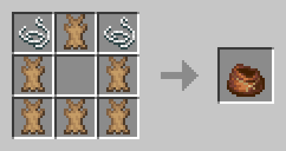

# Новые предметы и крафты

!!! new "Общий лут"
    В самых различных местах (Нюхач, подозрительный песок, т.п) был добавлен новый лут, дабы он не был таким бесполезным!

!!! new "Эхо-колокол"
    Эхо-колокол позволяет подсветить всех в некотором радиусе на 15 секунд. Один колокол имеет 8 зарядов, между которыми есть кулдаун в 30 секунд

    

!!! new "Крафт мешка"
    Крафт мешка добавлен на сервер! Он соответствует ванильному датапаку на мешок:

    { width=450}

!!! new "Крафт шаблона незеритового улучшения"
    Крафт шаблона незеритового улучшения был удалён. Взамен было повышено их количество и шанс выпадения в сундуках, а также был добавлен их спавн в крепостях Незера.

!!! new "Плюшевые игрушки"
    Теперь их **восемь** штук! Их всех можно получить совершенно разными способами, а вот какими - твоя задача узнать =)

    *может быть кто-то что-то получит, если найдёт их все...*

!!! changed "Мембрана"
    **Мембрана фантома** была переименована в **Мембрана**. Теперь она выпадает с **Вредины**.

!!! changed "Тотем бессмертия"
    Тотем не выпадает из **Призывателя** - до обновления сервера на 1.21.

    Связано с тем, что 1.21 в корне меняет фарм тотемов, от чего было принято решение пока что отключить получение тотемов.