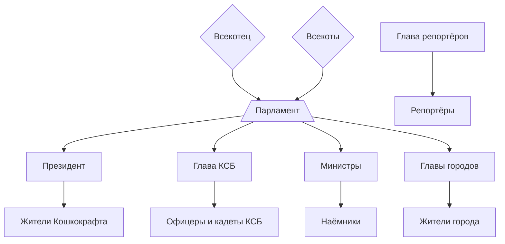

# **Правительство**

В нашей кошачьей стране многие аспекты жизни управляются правительством! 

В Правитесльство входят:

- Совет Пяти

- Министры

- ГКСБ

- Парламентёры

Контактные данные можно узнать командой `кто <ник>` в ВК или `/who <ник>` в Дискорде.

!!! example ""
    === "Парламент"
        В парламент входят все из правительства и главы **городов** (клан 4 уровня).

        Новые законы и новвоведения в правительстве решаются голосованием в Парламенте методом **абсолютного большинства** (51%)

        В парламент **не входят** Репортёры.

    === "Совет Пяти"
        **Совет Пяти** - основа сервера и РП составляющей. Каждый из Совета Пяти обладает **Символом Власти** - предметом в инвентаре, обозначающий определённый аспект власти.

        Данные символы передаются из рук в руки от котика к котику путём совместного решения правительства. Претендентом на вход в Совет может стать любой, проживший в стране более 30 часов, учавствующий в жизни граждан и имеющий инновационные идеи.

        Совет Пяти **обязан** иметь Символ Власти в инвентаре **всегда**. Именно наличие предмета в инвентаре и делает Котика одним из **Совета**.

        Символы власти:

        - **Символ Пути** - возвратный компасс

        - **Символ Исследования** - подзорная труба

        - **Символ Цепи** - цепь

        - **Символ Закона** - книга

        - **Символ Света** - звезда Незера

    === "Министры"
        === "Премьер Министр"

            { align=right width="150" }

            Правая рука Президента, помогает ему, и, по сути, выполняет его обязанности наравне с ним.

            Данный пост пока что никто не занимает.

            !!! success ""
                **Зарплата**: 37 АРов в неделю

        === "Министр Экономики"

            { align=right width="150" }

            Тот, кто отвечает за экономическую ситуацию на сервере, собирает налоги с магазинов и выплачивает АРы из казны!

            Данный пост занимает **sm1lly**

            !!! success ""
                **Зарплата**: 37 АРов в неделю

        === "Министр Строительства"

            { align=right width="150" }

            Отвечает за управление большими проектами строительства, их проектирование и помощь в их создании. Также занимается спавном и незер-хабом.

            Данный пост занимает **dark_moooon**

            !!! success ""
                **Зарплата**: 37 АРов в неделю
    
    === "Правопорядок"
        === "Глава Кошачьей Службы Безопасности - ГКСБ"

            { align=right width="150" }

            Человек, ответственный за найм и увольнение Офицеров, управление законами и правопорядком на сервере!

            Данный пост занимает **Elivor_**

            !!! success ""
                **Зарплата**: 37 АРов в неделю

        === "Офицер КСБ"
            Стражи правопорядка! Именно они принимают и решают репорты!

            У Офицеров есть своя униформа, дубинка и табельное оружие, доступное только им.

            Список всех Офицеров КСБ можно посмотреть в игре командой `/police list`

            !!! example ""
                Набор производится в канале `#работа` в нашем Дискорде!

            !!! success ""
                **Зарплата**: 32 АРа за каждый репорт

    === "Работяги"
        === "Репортёры"
            Те, кто первыми опубликуют новости, произошедшие в нашей стране!

            Репортёры **не из правительства**! Это отдельная группа котиков.

            Список репортёров можно посмотреть в нашем ДС, у них соответствующая роль.

            !!! example ""
                Набор производится в канале `#работа` в нашем Дискорде!

            !!! success ""
                **Зарплата**: 20 АРов за каждый пост + возможность публиковать платные посты от жителей

        === "Гиды"

            Это работяги, которые встречают новоприбывших в нашу страну по их запросу и проводят им экскурсию!

            Список гидов можно посмотреть в нашем ДС, у них соответствующая роль.

            !!! example ""
                Набор производится в канале `#работа` в нашем Дискорде!

            !!! success ""
                **Зарплата**: 25 АРов за проведённую экскурсию, **подтверждённую новичком**

<!-- ## Иерархия

!!! tip "Нон-РП информация"
    Всекотец и Всекоты - админы.

-->