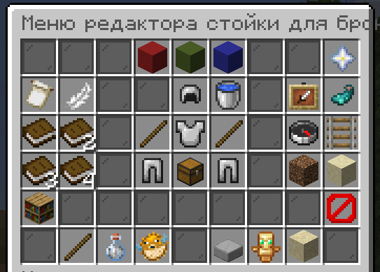

# Редактирование армор-стендов

Для редактирования армор-стенда достаточно ввести `/armorstand near` будучи рядом со стойкой. Откроется меню, в котором можно дать стойке вещи, повернуть её, подвинуть, сделай маленькой, повернуть руки/ноги/туловице, убрать плиту и прочее. 

Меню, возможно, немного запутанное, но всё работает =)

