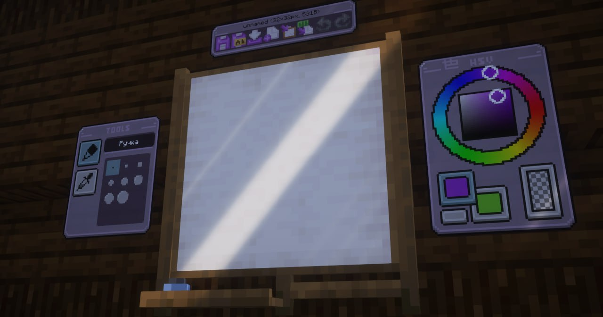
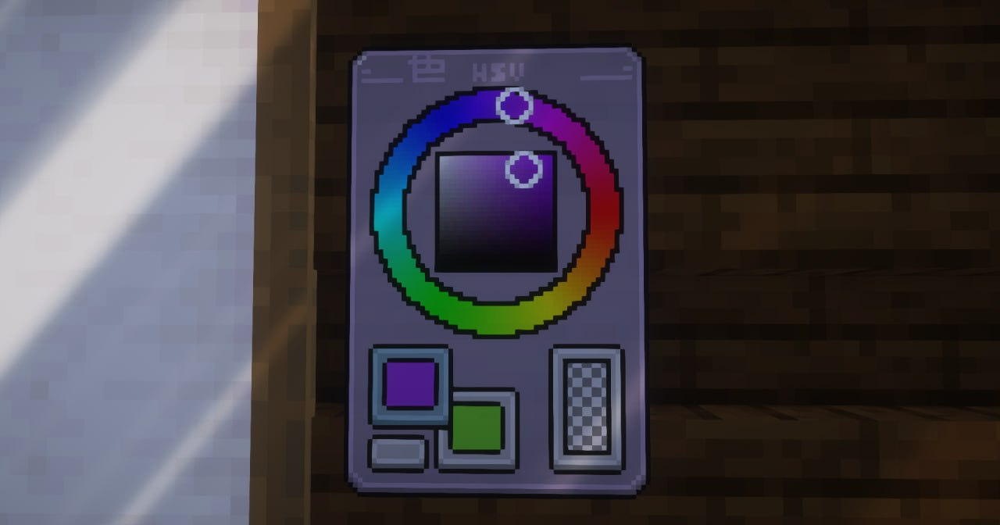
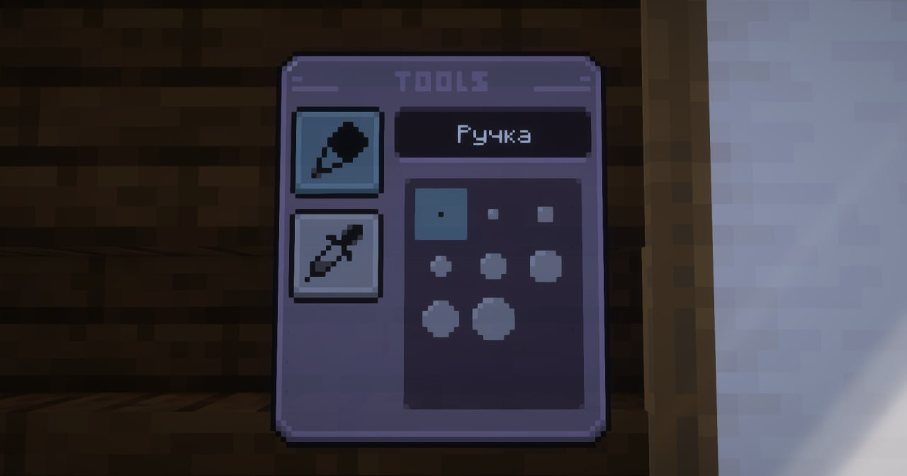
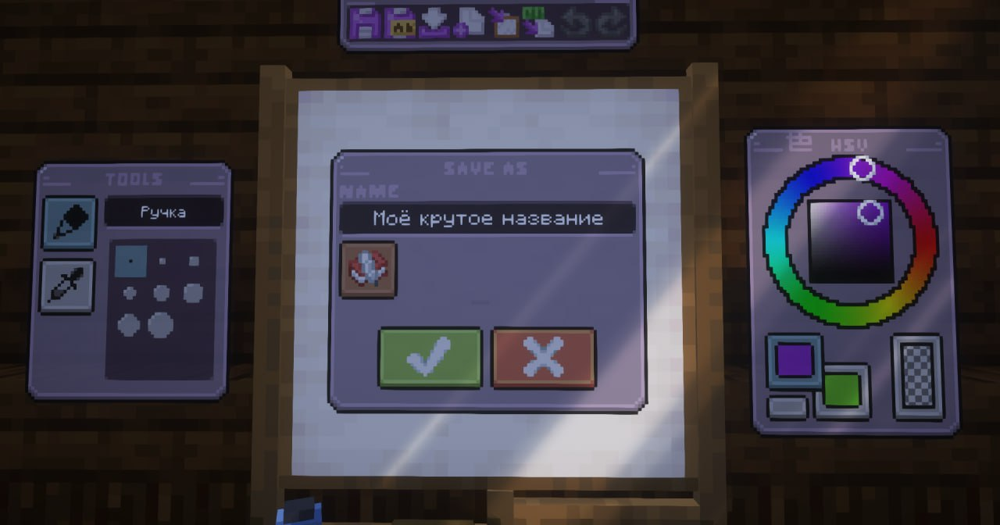
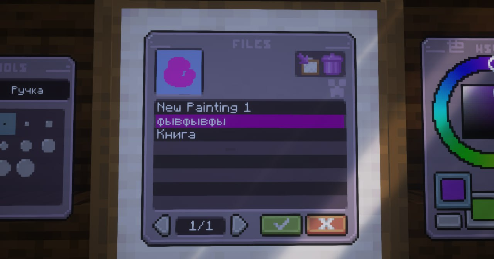
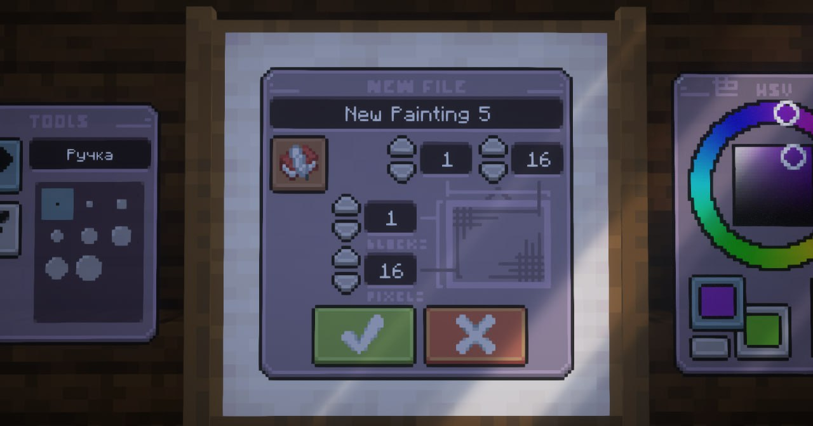

# Рисование

На сервере стоит замечательный датапак на рисование - MCPaint! Больше никаких громоздких мап-артов - создавай свои шедевры, сидя за холстом!

## **Как начать рисовать?**

Тебе нужны две вещи - любая картина и куриное яйцо!

Далее ставишь картину и бросаешь на неё яйцо, проиграется небольшая анимация и картина превратится в мольберт! Размер холста зависит от размера картины, но не волнуйся, его можно будет изменить в дальнейшем.

Далее кликаешь по `ПКМ` в нижнюю часть холста и садишься рисовать!

{width=800}

## **Что дальше??**

Все кнопки интерфейса нажимаются только если держать в руке кисточку, которая выдаётся когда садишься за холст.

Интерфейс представляет из себя следующее:

Справа от холста находится цветовой круг, в кольце можно выбрать оттенок цвета, а в квадрате его яркость и насыщенность.
Квадратики снизу обозначают выбранные цвета, первый и второй, их можно менять между собой для удобства. Прямоугольник справа это "прозрачный" цвет, т.е. то же что и ластик.
Для того чтобы сделать фон прозраным (например, для рисования граффити), возьми **Ножницы** и кликни ими по нижней части мольберта.

{width=800}

Слева находится окно выбора кисти и пипетки. Для кисти можно выбрать её размер и рисовать, выбрав пипетку можно выбрать цвет на холсте, не подбирая его в цветовом круге!

{width=800}

Сверху расположено меню сохранения и редактирования своей картины.

Последние две кнопки в виде стрелок - **"Отменить"** и **"Повторить"**, откатывают и возвращают действия. Так же, для удобства, откатывать и возвращать действия можно по нажатию `F` или `Shift + F` 

{width=800}

***
## **Как сохранять?**

Первые две кнопки в верхней панельке: **"Сохранить"** и **"Сохранить как"** позволяют, очевидно, сохранить картинку. По нажатию открывается меню, в котором предложат дать имя. 
Для названия нужно держать в хотбаре **Книгу и перо** со вписанным внутрь названием, без подписи. И нажать на иконочку книги снизу.

{width=800}

Третья кнопка **"Загрузить"** позволяет просмотреть все сохранённые работы и загрузить их на холст. Так же сохранённые работы можно сразу получить готовыми в виде предмета или удалить через две кнопочки в правом верхнем углу.

{width=800}

Четвёртая - **"Новый файл"**, создаёт новый холст, с возможностью задать ему имя с самого начала и выставить нужный размер. Ограничение мольберта на размер холста - **4х4 блока**!

{width=800}

Ну и наконец, пятая кнопка **"Экспортировать как размещаемую картину"**, она доступна после **Сохранения** и по нажатию выдаёт на руки готовую картину, котору можно размещать на стене!

Шестая кнопка **"Импортировать в код"** - пока что не работает =)