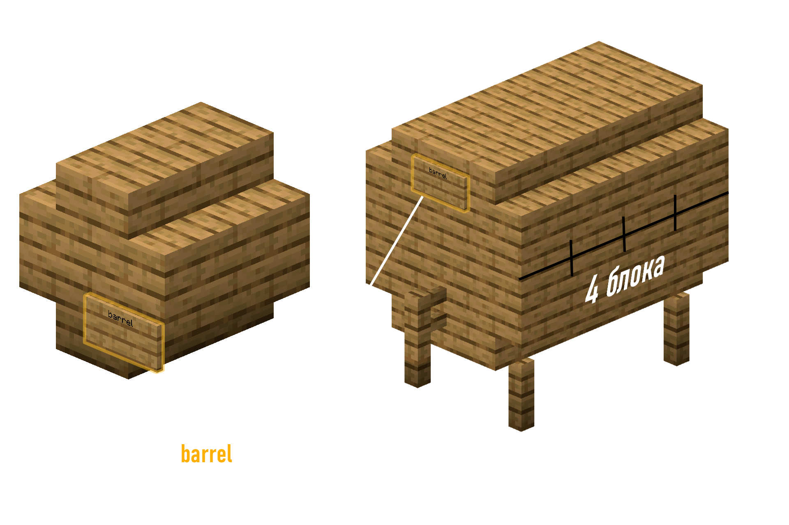

# Brewery

На сервере есть замечательный плагин на варку алкогольных (и не очень) напитков!

От крайне крепкого пива сорта Dragonblood до CUM!

## **Как варить?**

!!! abstract ""

    1. Ставишь котёл, наливаешь в него водички

    2. Под котёл ставишь что-то горячее: лаву, огонь, магму, костёр

    3. Берёшь ингредиенты на определённый напиток (все рецепты указаны ниже)

    4. Кликаешь ингредиентами `ПКМ` по котлу, и начинаешь ждать. Сколько ждать - написано в рецептах

        1. Чтобы узнать, сколько ты уже варишь напиток, можно нажать `ПКМ` по котлу, держа в руке **часы**.

    5. Когда подошло время - кликаешь пустыми бутыльками по котлу

    6. ???

    7. ПРОФИТ!

    !!! info "Звёзды"
        Качество напитка оценивается в звёздочках. Чем лучше ты следовал рецепту, тем больше звёзд и тем лучше напиток!

        А вот если звёзд мало, то напитки дадут плохие эффекты или даже **убьют**...

{ width=700 }

## Как бродить напиток?

Некоторые напитки требуют брожения в бочках.

Если напиток требует брожжения в дубовой бочке, то подойдёт самая обычная, но если напиток требует акациевую или вишнёвую бочку, то тебе нужно будет построить вот такие конструкции.

{ width=700 }

***

## Как дистиллировать?

Для дистилляции нужна зельеварочная стойка и светопыль. Просто кладёшь светопыль в верхний отсек, а напитки в нижний, и всё! Напиток дистиллируется!

{ width=700 }

***

## Напитки и их рецепты

TODO: Нужно сделать информацию про Котопедию

[ :material-arrow-right-top: Ссылка на таблицу ](https://docs.google.com/spreadsheets/d/1eeP827cOQyv0Hjfr392m7XS6pfpHPupX){ .md-button .md-button--primary }

<iframe src="https://docs.google.com/spreadsheets/d/e/2PACX-1vRBcp8GW0HhaNDzQdxor1FMwVGUs8Mf2WFshE67-etU5aTd_977CfzjlPDzV5D9ZA/pubhtml?widget=true&amp;headers=false" width=900 height=900></iframe>

