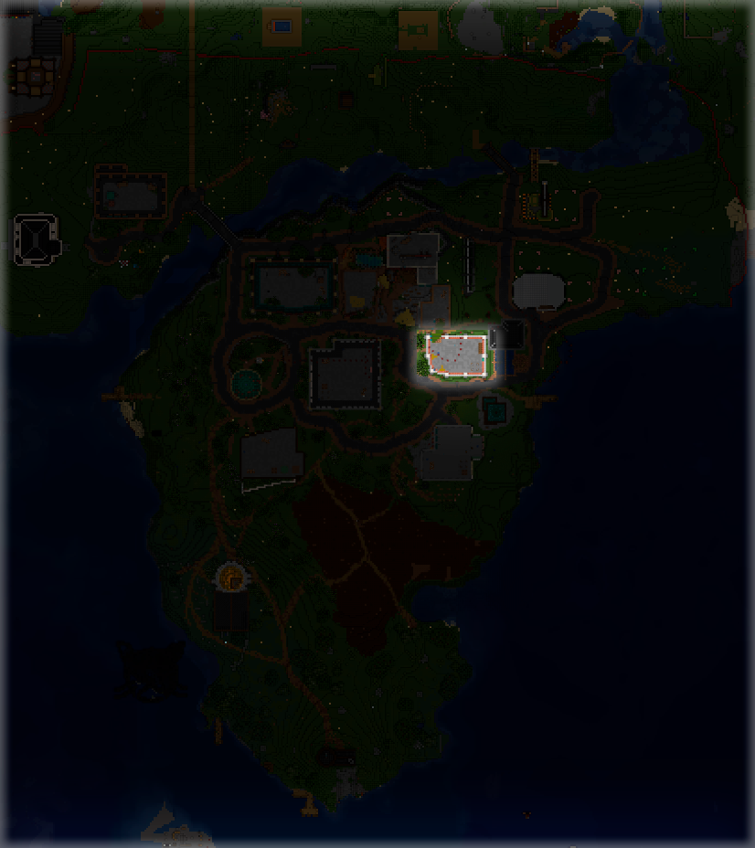

# Кланы

Хочешь создать свою гильдию? ОПГ? Банду? Эта страница для тебя!

***

Создание своего клана добавляет много новых возможностей:

- Личная точка дома для всех соклановцев

- **Общак** - общий сундук для соклановцев

- **Банк** - общий баланс АРов для соклановцев

- Возможность получить **личное достижение** на сервере на посещение территории вашего клана, **личный напиток** клана и разметку территории на онлайн-карте!

- И прочее!

## **Как создать клан?**

Всё очень просто! Стоимость создания клана составляет **32 АРа**. Для покупки нужно посетить NPC **Администратор**, она находится вот здесь:

{encoding="async" loading="lazy"}

## **Что дальше?**

Пишешь `/clan help` и смотришь какие команды тебе доступны =)
Для приглашения в клан достаточно прописать `/clan invite НИК`, для создания точки дома `/clan sethome` и т.д.

## **Уровни клана**

Свой клан можно **улучшать**, и получать более хорошие ништяки кланов! Для улучшения нужно иметь определенное кол-во участников в клане и иметь необходимое кол-во АРов на балансе клана. Делается это командой `/clan upgrade`

Всего уровня четыре:

| Уровень     | Кол-во общаков  | Множитель опыта с мобов | Стоимость улучшения | Кол-во участников для улучшения | Доп. награды                   |
| :---------- | :------------- | :--- | :----- |:----| :--------------------------------------------                   |
| `Банда`     | 0              | 1x   | 32 АР  |5    | -                                                               |
| `Клан`      | 1              | 1.1x | 128 АР |10   | -                                                               |
| `Гильдия`   | 1              | 1.5x | 256 АР |20   | Свой напиток города                                             |
| `Город`     | 2              | 2x   | 512 АР |-    | Достижение города, префиксы перед ником, отметка на карте       |

!!! tip ""
    Доп. награды запрашиваются в канале `#запросы` в нашем [Дискорд канале][discord]!

## Баффы клана

За небольшую плату можно купить **бафф клана** - определенный эффект для всех участников клана в онлайне! Например, за **32 АРа** можно купить **Спешку II на 10 минут**!

Сделать это можно командой `/clan buff`, если клан выше второго уровня.