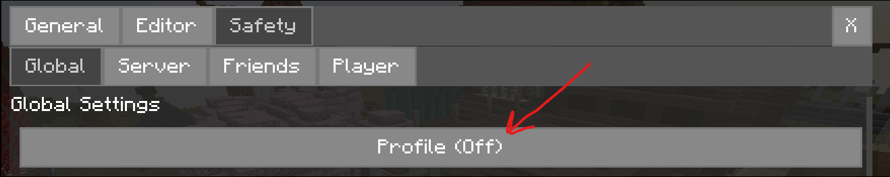
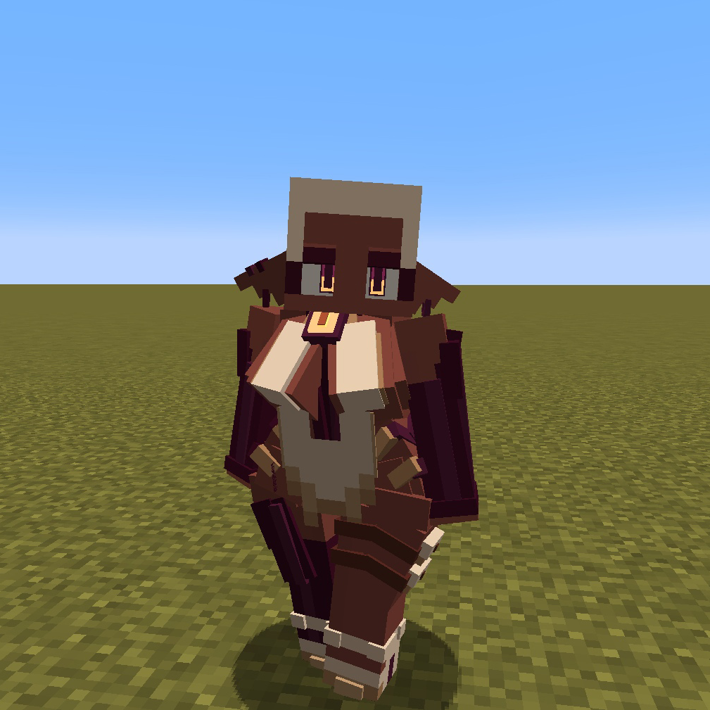
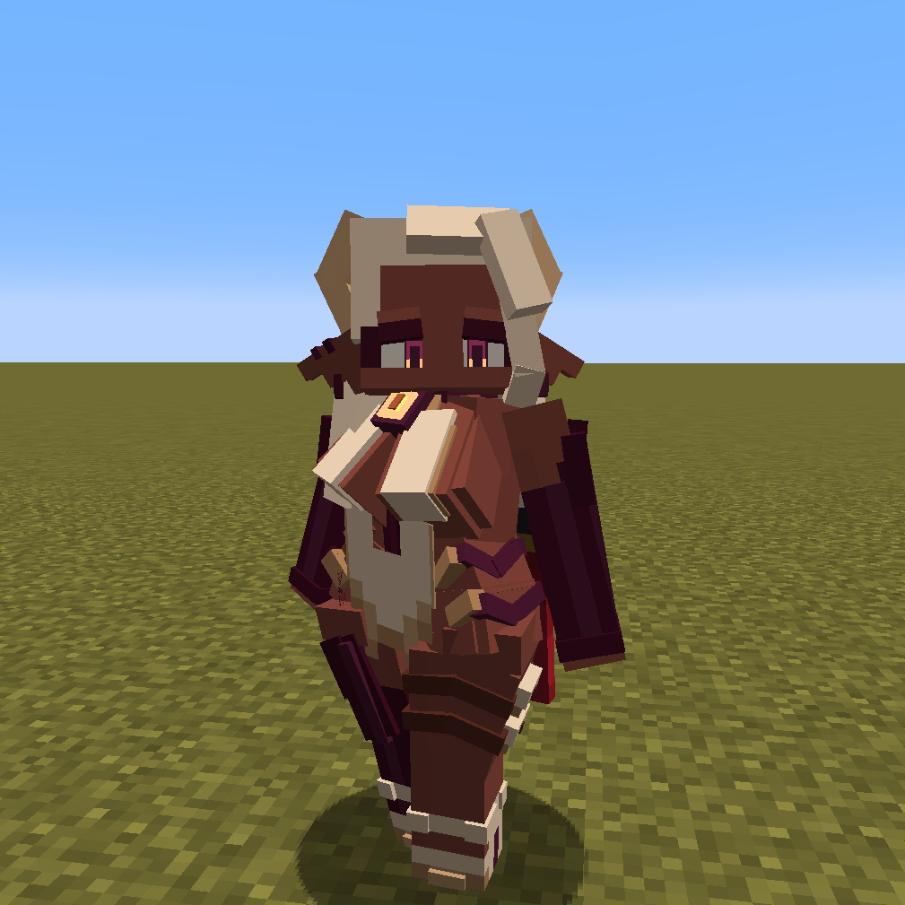

# Customizable Player Models

На сервере есть поддержка мода на изменение модельки персонажа - он называется **Customizable Player Models**. Данный мод позволяет менять тело игрока как частично (например: добавить шляпу, лицо и анимацию, протез ноги), так и полностью на любую вами созданную!

!!! success ""
    Скачивание доступно на любой загрузчик модов!

    **Ссылка:** [https://modrinth.com/plugin/custom-player-models/versions](https://modrinth.com/plugin/custom-player-models/versions)

!!! danger ""
    Когда скачаешь мод - нажми английскую ++g++, зайди в `Safety Settings` справа снизу и выбери `Profile: Off`! Иначе ты не увидишь многие модельки игроков!

    {width=700}

    ***

    {width=700}

***

## **Пример модели**

Вот пример модели с разными волосами и с разными лицевыми анимациями, которые можно менять прямо во время игры.

  

    

      
    

    

      
    

    

      
    

  

  <button class="carousel-button prev-button">&#10094;</button>
  <button class="carousel-button next-button">&#10095;</button>
  
1 / 3

***

## Как установить/создать свою модель CPM?

!!! warning "Недоделанный гайд"
    Гайд написан очень кратко, но основная суть правильная.

1. В внутриигровом меню мода нажимаешь `File` -> `Export`, выбираешь `Model`, выбираешь `Gist`, копируешь текст в поле

2. Регистрируешься на [GitHub](https://github.com)

3. Создаёшь `gist`, вставляешь туда скопированный текст

    { width=450 }

4. Копируешь ссылку на этот `gist`

5. Вставляешь в игре, экспортируешь модель

6. Готово!

## Создание своей модели

Пока что я не знаю, как создавать свои модели. Потыкайся в внутриигровом редакторе или зайди на [официальную вики мода](https://github.com/tom5454/CustomPlayerModels/wiki)!
