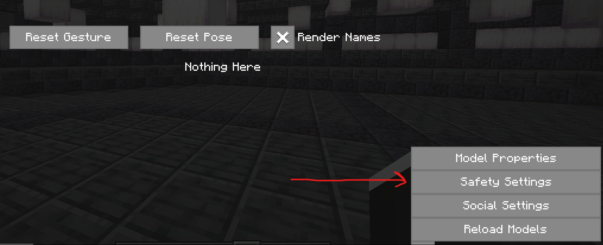

# Customizable Player Models

На сервере есть поддержка мода на изменение модельки персонажа - он называется **Customizable Player Models**. Данный мод позволяет менять тело игрока как частично (например: добавить шляпу, лицо и анимацию, протез ноги), так и полностью на любую вами созданную!

!!! success ""
    Скачивание доступно на любой загрузчик модов!

    **Ссылка:** [https://modrinth.com/plugin/custom-player-models/versions](https://modrinth.com/plugin/custom-player-models/versions)

!!! danger ""
    Когда скачаешь мод - нажми английскую ++g++, зайди в `Safety Settings` справа снизу и выбери `Profile: Off`! Иначе ты не увидишь многие модельки игроков!

    {width=700}

    ***

    {width=700}

***

## **Гайд по установке своей модели**

[:material-arrow-top-right: Скачивание и установка своей модели](){ .md-button .big-button align=center .md-button--primary }

***

## **Пример модели**

Вот пример модели с разными волосами и с разными лицевыми анимациями, которые можно менять прямо во время игры.

{width=800}

{width=800}

{width=800}