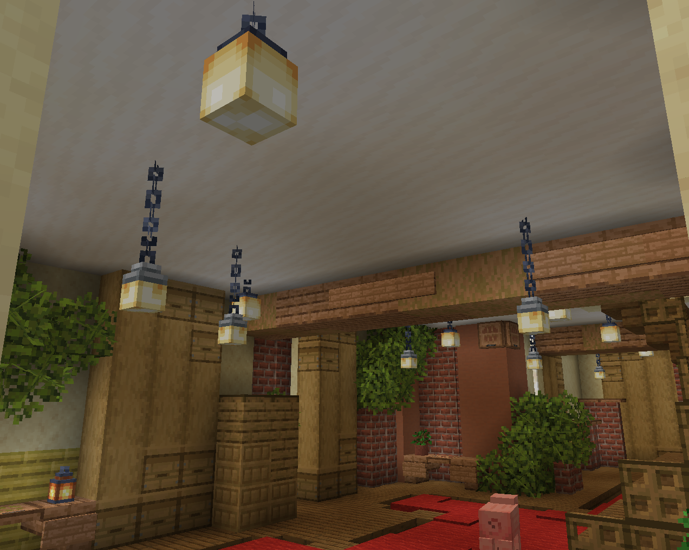
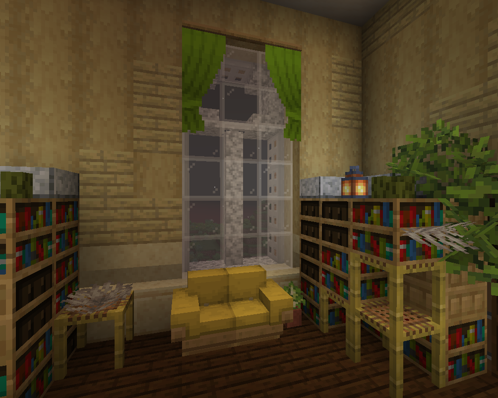

# Мебель и декорации

На Кошкокрафте есть полноценная механика **мебели** и **декораций**! Они являются не просто предметами в рамке, а полноценными функциональным блоками!

Крафт мебели и декораций производится на [**Столе декора**](../../../items/blocks/decor_table)!

***

## **Теги**

В описании каждого декора и мебели есть "теги", обозначающие их особые механики:

- 

    **Источник света**

    Это декор, который излучает свет, подобно обычным лампам или факелам.

    { width=600 }

- 

    **Интерактивное**

    Это декор, который имеет функционал если по нему кликнуть <kbd>ПКМ</kbd>.

    { width=600 }

- 

    **Можно покрасить**

    Это декор, который можно покрасить с помощью [**Малярной кисти**](../../../items/custom_items/paint_brush)

    { width=600 }

- 

    **Можно сесть**

    Это декор, на котором можно сидеть!

    { width=600 }

***

!!! info "Источники"
    **Большинство** моделей взяты из ресурспака <a href="https://vk.com/ksepsp" target="_blank">**КСЭПСП**</a>

