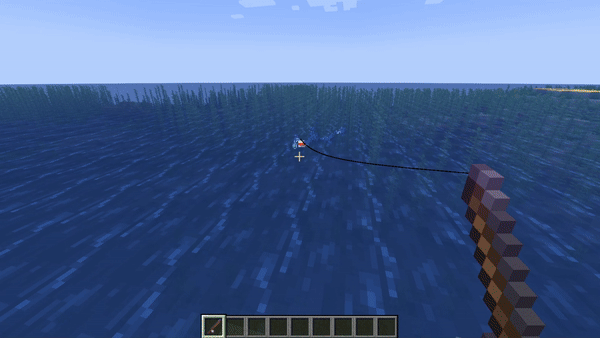

# Рыбалка

На сервере стоит уникальный плагин на рыбалку! Теперь вам не нужно тупо стоять в АФК полчаса, нажимая <kbd>ПКМ</kbd>, вместо этого ловля рыбы превращается в мини-игру!

Почти всех рыбок можно продать **Рыбака**. Цена рыб зависит от редкости, и варьируется от **0.1** до **5** АР!  

!!! warning "**Важно!**"
    Рыбалка **не** работает без ресурспака!

## Ловля рыбок

Многие рыбки отличаются **по условиям** ловли - некоторые могут ловиться лишь в определенной воде (например: речка, океан, тёплый океан), некоторые могут ловиться лишь на определенной высоте, а некоторые лишь **в других мирах**.

## Система приманок

Шанс вылавливания хорошей рыбы можно повысить при помощи **приманок**! Самые базовые приманки - **Хлеб** и **Золотая морковь** они повышают шанс на ловлю более крутой рыбки и уменьшают время ловли.

Также есть **специальные приманки**, которые помогают выловить определенные предметы.

Для использования достаточно положить приманку или предмет во вторую руку и начать ловить рыбку. Если приманка ушла вместе с крючком - она была использована!

***

## Все мини-игры

  

    

      
      
Нажимая на Shift, нужно довести рыбку до конца, но нужно следить за индикатором, иначе леска оборвётся!

    

    

      
      
Тут всё просто - нужно вовремя нажать <kbd>ПКМ</kbd> по определённому цвету.

    

    

      
      
Тут, нажимая Shift, нужно удержать рыбку на зелёной области 

    

    

      
      
Тут нужно попасть в зелёную область! 

    

    

      
      
Тут тоже самое - нужно попасть в зелёную часть, но уже без разных цветов.

    

    

      
      
Аналогично - попасть в зелёную часть, без разных цветов.

    

    

      
      
Тут уже сложнее. На экране пишутся стрелочки, которым нужно следовать.  

    

  

  <button class="carousel-button prev-button">&#10094;</button>
  <button class="carousel-button next-button">&#10095;</button>
  
1 / 3

<!-- ### **Гонка**

Нажимая на ++left-shift++, нужно довести рыбку до конца, но нужно следить за индикатором, иначе леска оборвётся!

{width=800 loading="lazy" decoding="async"}

### **Попади в цвет**

Тут всё просто - нужно вовремя нажать <kbd>ПКМ</kbd> по определённому цвету.

{width=800 loading="lazy" decoding="async"}

### **Удержи**

Тут, нажимая ++left-shift++, нужно удержать рыбку на зелёной области

{width=800 loading="lazy" decoding="async"}

### **Попади**

Тут нужно попасть в зелёную область! 

Зелёный - 100%

Жёлтый - 50%

Оранжевый - 25%

Красный - 0%

{width=800 loading="lazy" decoding="async"}

### **Попади v2**

Тут тоже самое - нужно попасть в зелёную часть, но уже без разных цветов.

{width=800 loading="lazy" decoding="async"}

### **Попади v3**

Аналогично - попасть в зелёную часть, без разных цветов.

{width=800 loading="lazy" decoding="async"}

### **Танцуй**

Тут уже сложнее. На экране пишутся стрелочки, которым нужно следовать.

:material-arrow-left: - ЛКМ, :material-arrow-right: - ПКМ, :material-arrow-up: - Пробел и :material-arrow-down: - Шифт

{width=800 loading="lazy" decoding="async"} -->
