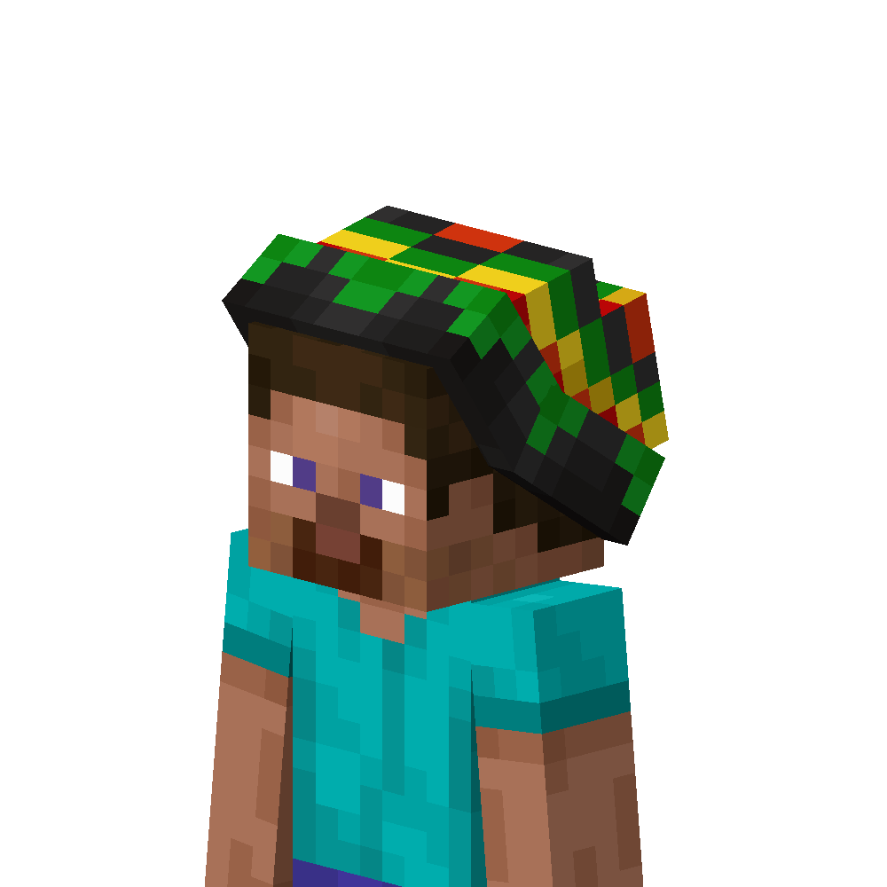
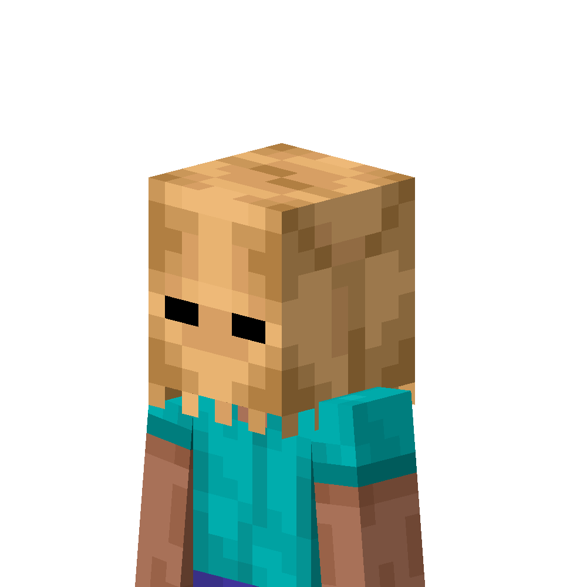

# Ресурспак

На нашем сервере стоит ресурспак, который добавляет тонну контента! Крайне советуем установить мод [RP Renames](https://modrinth.com/mod/rp-renames), чтобы видеть все переименования прямо в наковальне!

!!! tip ""
    Для установки ресурспака нужно зайти на сервер с включённой опцией или, в случае чего, прописать команду `/rp`

    **Важно!** Ресурспак не загружается с сервера на **Pojav** и подобных лаунчерах! Это их ошибка, не наша.

!!! warning "К сожалению..."
    На 1.20.6 пока что нет мода **CIT Resewn**, а Optifine не поддерживает переименования, от чего они временно удалены с сервера.

## Переименования из ресурспака

Много вещей ты можешь получить сразу, просто переименовав предметы!  
А переименование без потери опыта и без наковальни доступны всем [Котикам+](../../info/donate.md)...

!!! success ""
    === "KSEPSP"
        ### Список всех вещей из ресурспака KSEPSP:

        [https://definitelyawhale.github.io/ksepsp_website/](https://definitelyawhale.github.io/ksepsp_website/)

        Более 250 различных текстур на вкус и цвет и для любой РП ситуации!

        Огнестрельное оружие, приборы, шляпы, броня, элитры!

        ВК создателей ресурспака: [https://vk.com/ksepsp](https://vk.com/ksepsp)

    === "Игры"
        

        -  __Шахматы - белые__

            Для создания белых шахмат, нужно переименовать **белую** шерсть в название фигуры:

            - Пешка

            - Ладья

            - Слон

            - Конь

            - Королева

            - Король

            { width=250 }
        
        -  __Шахматы - чёрные__

            Для создания белых шахмат, нужно переименовать **чёрную** шерсть в название фигуры:

            - Пешка

            - Ладья

            - Слон

            - Конь

            - Королева

            - Король

            { width=250 }

        - __Игральные карты__

            Для создания, нужно переименовать **бумагу** в `<цифра> <масть>`:

            - 10 бубен

            - король пики
            
            - королева черви

            - 3 крести

            
        

    === "bkke rp"
        Ресурспак от нашего Всекота - **bykkake747**!

        

        - __стоник 1 ИЛИ стоник 2 ИЛИ стоник 3__

            Нужно переименовать **Тотем бессмертия**

            От цифры меняется положение или рука, где будет патч

            { width=250 }

        - __шапка растамана__

            Нужно переименовать **вырезанную тыкву**

            { width=250 }

        - __битард__

            Нужно переименовать **вырезанную тыкву**

            { width=250 }

        - И многое другое...

        

    === "CEFI KSEPSP Addon"
        Аддон для ресурспака КСЭПСП!

        ### **Все переименования CEFI:**

        [ :material-arrow-right-top: Список предметов CEFI](https://drive.google.com/file/d/1MhYvt2qRNRXOUdI46tRtEnD72qKZ4UbQ/view){ .md-button .big-button .md-button--primary }

    === "RokakaPack"

        Крутой ресурспак, добавляющий много оружия, инструментов и приколов.

        Список всех предметов:

        [ :material-arrow-right-top: Список предметов Rokaka](https://drive.google.com/file/d/1MfgCE7-MASEcsISQ9A9LDMlcr_YcjPos){ .md-button .big-button .md-button--primary }

        