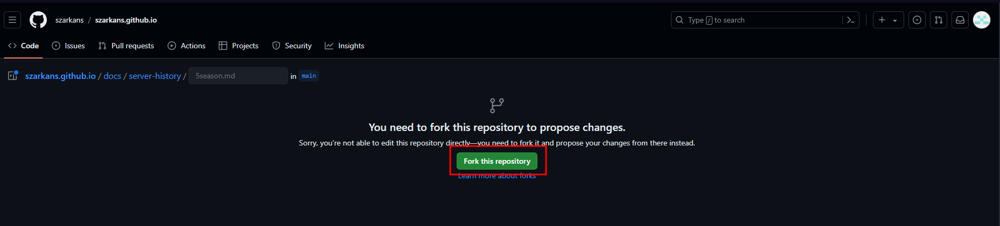

# Как изменить Вики?

Нашёл ошибку и хочешь помочь админу её исправить? Это замечательно!

1. Нажми сверху справа страницы на иконку **Карандаша** - тебя перекинет на **GitHub**

2. Войди или зарегестрируйся в **GitHub**

3. После этого нажми зелёную кнопку **Fork this repository**

    

4. Далее у тебя откроется файлик - именно его тебе и нужно изменить!

5. После изменений, нажми сверху справа зелёную кнопку **Commit changes**

    - Укажи в **Commit message** краткую информацию о том, что именно ты изменил

    

6. Сообщи **Всекотцу** об изменении

7. Всё!