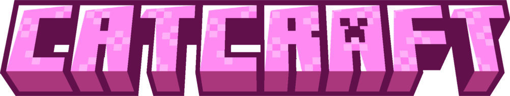

{ align=right width=600 .image-shadow }

<h1 class="shadow margin-center">Приватная Ванилла+ c элементами Role-play и котиками!</h1>

 

Привет! Ты на Вики Кошкокрафта!  
Здесь мы стараемся разбавить ванильный Майнкрафт полезными и крутыми фишками,  приправляя это элементами РП и самоуправлением игроков! 
И всё это - бесплатно. <u>Навсегда</u>.

***

<h1 class="shadow">Наши фишки</h1>

-   :material-star:{ .lg .middle .shadow } __Куча уникального контента!__

    ---

    Свой [собственный ресурспак](gameplay/unique/resourcepack.md), ежедневные [квесты](gameplay/unique/npc.md), [1000+ достижений](gameplay/unique/datapacks.md), кастомная [рыбалка](gameplay/unique/fishing/index.md), ребалансы для более честной игры, новые предметы и механики для улучшения качества жизни!

    ---

    {width=450}

-   :material-bank:{ .lg .middle .shadow } __Элементы РП!__

    ---

    Правительство, управляющее строительством, полицией и новостями.  
    Никаких приватов - есть **законы территорий**!  
    Экономика в АРах!

    ---

    {width=450}

-   :octicons-package-16:{ .lg .middle .shadow } __Никаких ограничений!__

    ---

    Делай что твоей душе угодно - создай ОПГ, [свергни правительство](server-history/5season/#14_-), построй огромную постройку 1000 блоков в высоту или стань богатейшим игроком Кошкокрафта!

    ---

    {width=450}

- :material-gamepad-variant:{ .lg .middle .shadow } __А также...__

    ---

    * [Награды игрокам за постройки, идеи, баги и т.п.](gameplay/rewards/list.md)!

    * Партнёрство с [Ютуберами и Стримерами](info/for_media.md)!

    * Частые и интересные РП ивенты!

    * Частые обновления с новым контентом, которые можно отслеживать в [Дискорде][discord]!

    * И просто лучшее коммьюнити во всём РуМайне!

    ---

    

***

<h1 class="shadow">Частые вопросы</h1>

!!! question ""

    === "Как к нам попасть?"

        Мы - приватный сервер, и попасть к нам можно **написав заявку**. Сделать это можно в нашем [Discord][discord].

        Заявки нужно писать тщательно, ведь именно она является "барьером" от мамкиных гриферов и читеров.

    === "Нужна лицензия?"

        Нет! Ты можешь играть как с лицензии, так и с пиратки.

        Но, к сожалению, нельзя играть с **Bedrock Edition**.

    === "Какой средний онлайн?"

        Каждый день в районе 30-35. Пик - 55 игроков!

    === "Когда был последний вайп? Когда следующий?"

        Перед тем, как узнать дату вайпа, хотим тебе рассказать:
    
        - Если ты волнуешься, что тебе не достанется лута - ванильные сундуки восстанавливаются раз в месяц

        - Если ты волнуешься, что все структуры залутаны - они восстанавливаются время от времени админами

        - Если ты волнуешься, что все игроки в топовых шмотках - аналогично будет и через неделю после вайпа

        Поэтому не стоит сильно заострять внимание на дате вайпа =)

        Вайп был 1 июля 2024. Дата следующего вайпа неизвестна никому.

    === "Какая валюта сервера?"

        **АРы** - Алмазная руда, в основном **глубиносланцевая**. Это намного лучше алмазов, ведь у "старичков" с Удачей нет приемущества над новичками!

    === "У меня остались вопросы!!!"

        Ничего страшного! Ответы на множество вопросов есть либо на этой Вики, либо на странице [ЧаВо](info/faq.md).  
        
        Если нигде не нашёл ответ - милости просим в наш [Дискорд][discord]!

***

<h1 class="shadow">Все ещё не уверен?</h1>

Просмотри все наши ресурсы и углубись в атмосферу нашего сервера!

<a href="https://discord.gg/23XJyDGJaH" target="_blank">
:simple-discord:{ .lg .middle .shadow .discord } **Discord** Заявки, общение и новости!
</a>
{ .card }

<a href="https://vk.com/catcraftmc" target="_blank">
:simple-vk:{ .lg .middle .shadow .vk } **Группа ВК** Новости и альбомы сезонов!
</a>
{ .card }

<a href="https://www.youtube.com/watch?v=dQw4w9WgXcQ&pp=ygUXbmV2ZXIgZ29ubmEgZ2l2ZSB5b3UgdXA%3D" target="_blank">
:simple-youtube:{ .lg .middle .shadow .yt } **Наш YouTube** Видео с нашего сервера!
</a>
{ .card }

<a href="./server-history/1season">
:octicons-book-16:{ .lg .middle .shadow } **История сезонов** Как развивался сервер
</a>
{ .card }

<a href="https://www.youtube.com/watch?v=dQw4w9WgXcQ&pp=ygUXbmV2ZXIgZ29ubmEgZ2l2ZSB5b3UgdXA%3D" target="_blank">
:octicons-globe-16:{ .lg .middle .shadow } **Онлайн-карта** Посмотреть на сервер вживую!
</a>
{ .card }

<!-- 
{ align=right width="600" .image-shadow }

<h1 class="shadow">У нас ты найдёшь</h1>

- [Кастомную рыбалку](../gameplay/unique/рыбалка/), [NPC с квестами](../gameplay/unique/npc), [1000+ достижения](../gameplay/unique/datapacks), [свой собственный ресурспак](../gameplay/unique/resourcepack) с тонной контента!

- РП элементы:

    - Войсчат внутри игры, анимации персонажа (более 100 штук!), кастомные модели персонажа

    - [Правительственные роли](../gameplay/roleplay/goverment.md) - президента выбирают игроки, полицейские в игре решают проблемы гриферства и воровства, министры контролируют экономику и постройку спавна и многое другое!

    - Казна страны, в которой находятся деньги правительства и игроков, является **обычным** сундуком!

    - Экономика в АРах, от чего у "старичков" нет приемущества над новичками!

- Лучшая администрация, самые крутые игроки и просто лучший сервер, который ты увидишь!

<h1 class="shadow">Как к нам попасть?</h1>

!!! success "Важное уточнение"
    Наш сервер **абсолютно** бесплатный! Всё что тебе нужно - проследовать пунктам ниже :3 
    *(если тебе конечно не лень писать заявку, и ты хочешь купить вход без заявки)*

Всё очень просто!

{ align=right width="600" .image-shadow }

- Зайти в наш [Дискорд](https://discord.gg/Qfb6NGZkNn)

- Переходишь в канал `#заявка`

- Заполняешь заявку и ждёшь результата!

Заявки рассматриваются от `1 минуты` до `1 суток`, но чаще всего **в районе часа**!

## Наш проект
[:simple-vk: ВК](https://vk.com/catcraftmc){ .md-button }
[:simple-discord: Наш Дискорд](https://discord.gg/Qfb6NGZkNn){ .md-button }
[:simple-youtube: Наш YouTube](https://youtube.com/@catcraftminecraft){ .md-button }
[:map: Онлайн-карта сервера](./info/onlinemap.md){ .md-button } -->