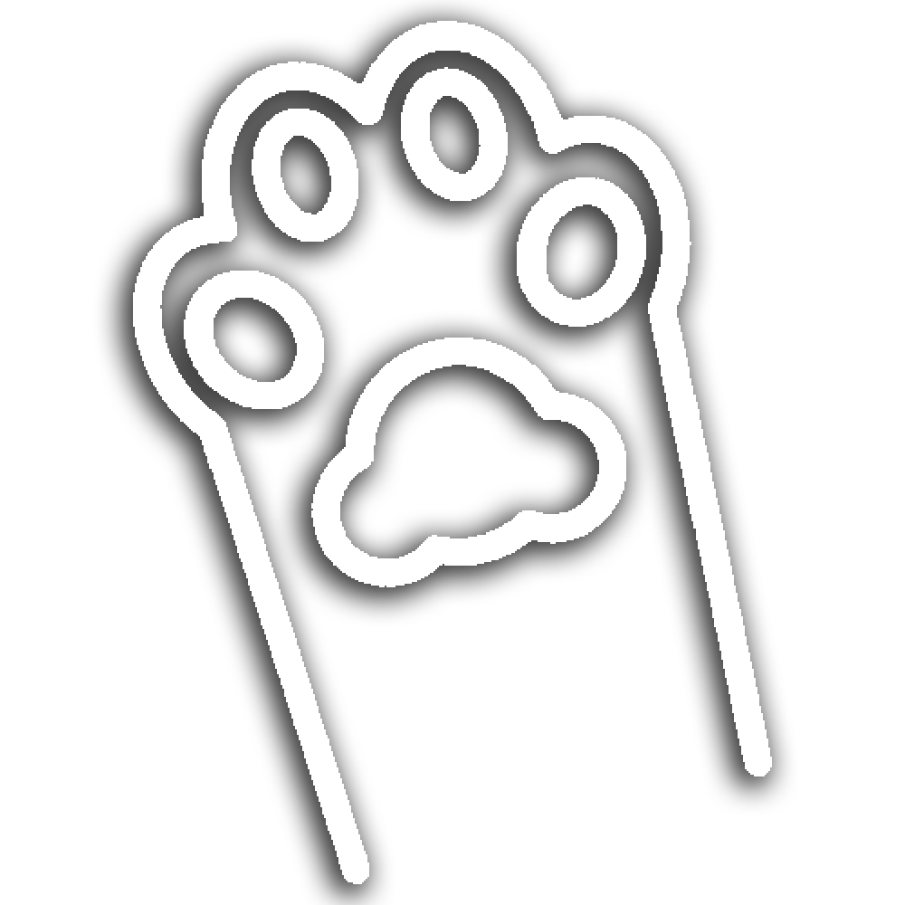
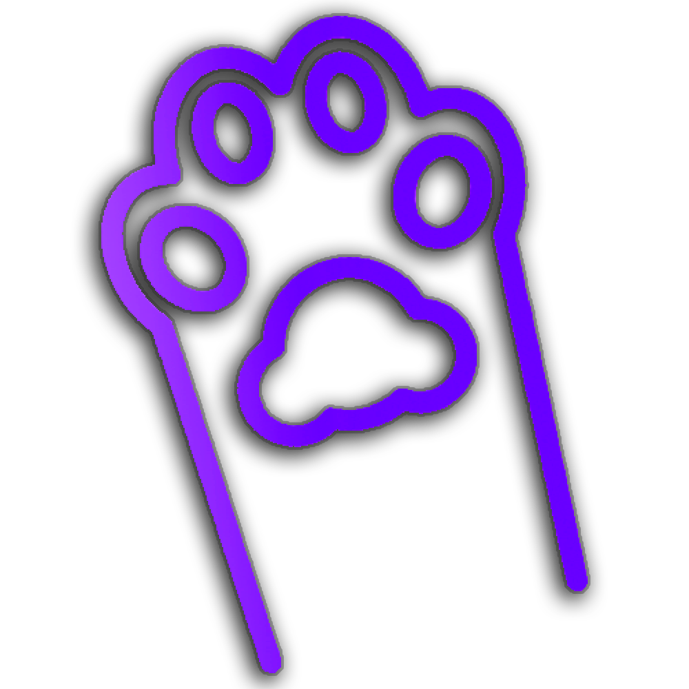

# Брендбук

## Цвета

    <b>Основной градиент</b> #804feb -> #4728b6
    { .card .brand-book-color-gradient .cursor-pointer .margin-center }

    <b>Основной цвет</b> #4f2dbe
    { .card .margin-center .cursor-pointer .brand-book-color-main }

    <b>Наш белый</b> #f5f5f5
    { .card .margin-center .cursor-pointer .brand-book-color-white }

    <b>Наш чёрный</b> #101114
    { .card .margin-center .cursor-pointer .brand-book-color-black }

## Логотипы

  
  
  

[Скачать логотипы](../../assets/logos.rar){ .md-button .md-button--primary .big-button }

## Фоны

### Обычный

### Для донатов

