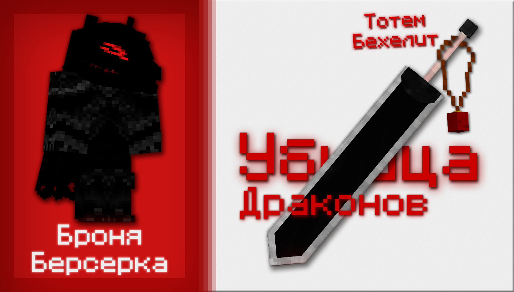
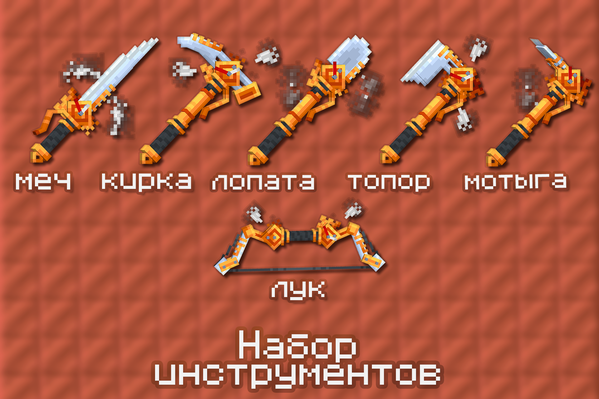

# Донатик

## Котик+

Это ежемесячные привилегии, добавляющие удобные и полезные команды! 
Можно купить как на месяц, так и на **весь сезон**!

!!! note ""
    
    === "Котик+"
        - `/sethome` `/home` - одна точка дома. КД - 10 минут

        - `/heal` - вылечить себя или другого. КД - 10 минут

        - `/feed` - насытить себя или другого. КД - 10 минут

        - `/wb` - виртуальный верстак

        - `/hat` - надеть предмет на голову

        - `/itemname` - поменять название предмета

        - `/nick` - поменять себе ник на любой, в т.ч. цветной или даже градиентный!

        - Можно писать цвета на табличках, в наковальне и в книге

            - Через текстовые символы по типу `&e`, `&4`, `&l` и т.п.

        - 4 строчки в Эндер-сундуке

        - Ежедневный кит с плюшками!

        Выдаётся на месяц :3 

        [:fontawesome-solid-money-bill-trend-up: Купить на сайте](https://donate.catcraftmc.ru){ .md-button .md-button--primary }

    === "Котик++"
        - `/sethome` `/home` - одна точка дома. КД - 10 минут

        - `/heal` - вылечить себя или другого. КД - 10 минут

        - `/feed` - насытить себя или другого. КД - 10 минут

        - `/wb` - виртуальный верстак

        - `/hat` - надеть предмет на голову

        - `/itemname` - поменять название предмета

        - `/nick` - поменять себе ник на любой, в т.ч. цветной или даже градиентный!

        - Можно писать цвета на табличках, в наковальне и в книге

            - Через текстовые символы по типу `&e`, `&4`, `&l` и т.п.
        
        ### Только для Котик++

        - `/repair`- починить предмет в руке. КД - сутки

        - `/ec` - виртуальный эндер-сундук

        - `/anvil`- виртуальная наковальня

        - `/loom` - виртуальный ткацкий станок

        - `/smithingtable` - виртуальный кузнечный стол

        - `/back` - вернуться на место смерти / место телепортации. КД - 10 минут

        - `/sethome` `/home` - две точки дома. КД - 10 минут

        - 5 строчек в эндер-сундуке

        - Ежедневный кит с плюшками!

        Выдаётся на месяц :3

        [:fontawesome-solid-money-bill-trend-up: Купить на сайте](https://donate.catcraftmc.ru){ .md-button .md-button--primary }

    === "Котик+++"
        - `/sethome` `/home` - одна точка дома. КД - 5 минут

        - `/heal` - вылечить себя или другого. КД - 5 минут

        - `/feed` - насытить себя или другого. КД - 5 минут

        - `/wb` - виртуальный верстак

        - `/hat` - надеть предмет на голову

        - `/itemname` - поменять название предмета

        - `/nick` - поменять себе ник на любой, в т.ч. цветной или даже градиентный!

        - Можно писать цвета на табличках, в наковальне и в книге

            - Через текстовые символы по типу `&e`, `&4`, `&l` и т.п.
        
        - `/repair`- починить предмет в руке. КД - 12 часов

        - `/ec` - виртуальный эндер-сундук

        - `/anvil`- виртуальная наковальня

        - `/loom` - виртуальный ткацкий станок

        - `/smithingtable` - виртуальный кузнечный стол

        - `/back` - вернуться на место смерти / место телепортации. КД - 5 минут

        - `/sethome` `/home` - две точки дома. КД - 5 минут

        ### Только для Котик+++

        - Все КД снижены вдвое. (`/home` раз в 5 минут вместо 10 и т.п.)

        - `/tpaaccept` - возможность принять запрос на телепортацию от игроков, прописавших `/tpa`
        
        - `/spawn` - телепортация на спавн. КД - 2 часа.

        - 6 строчек в Эндер-сундуке!

        - Опыт не пропадает при смерти!

        - Ежедневный кит с плюшками!

        Выдаётся на месяц :3   

        [:fontawesome-solid-money-bill-trend-up: Купить на сайте](https://donate.catcraftmc.ru){ .md-button .md-button--primary }

## Облики

Это скины на твои инструменты, броню, тотемы или прочее!

**Важно!** При покупке тебе выдаются **свитки** обликов - эти свитки ты можешь наложить на свои существующие предметы.

-   Набор **Chainsaw Man**

    ---

    { width=400 }

    ---

    Набор скинов из аниме Человек-бензопила!
    
    В наборе:

    - Два меча-бензопилы

    - Шлем человека-бензопилы

    - Три тотема Пауэр

- Набор **Jojo**

    ---

    { width=400 }

    ---

    Набор скинов на тотемы из Jojo!

    В наборе 9 тотемов бессмертия с различными стендами!

- Набор **BERSERK**

    ---

    { width=400 }

    ---

    Набор скинов из манги и аниме **БЕРСЕРК**

    В наборе:
    
    - Сет брони Берсерка

    - Убийца драконов

    - 3 тотема Бехелит

- Набор **Неоновое творение**

    ---

    { width=400 }

    ---

    Набор **анимированных** инструментов в стилистике Киберпанк!

    В наборе:

    - Инструменты

    - Маска

- Набор **Цветущей Вишни**

    ---

    { width=400 }

    ---

    Набор инструментов, созданных из стали, выкопанной из под цветущей сакуры...

    В наборе все инструменты в вишнёвом стиле.

- Набор **Стимпанковское безумие**

    ---

    { width=400 }

    ---

    Набор настоящих работяг в стиле Стимпанк! Набор **полностью** анимирован!

    В наборе все инструменты в стиле Стимпанк!

- Набор **Божественное откровение**

    ---

    

    Анимированный набор всех инструментов и оружия в божественном стиле!

## Где купить?

Донатик можно купить тремя способами:

!!! note "" 

    === "Через сайт"
        Через сайт [автодоната](https://donate.catcraftmc.ru).

        !!! success ""
            Доступно жителям РФ, Европы, Украины и др.

        ### Покупка:

        1. Выбираешь товар, вписываешь ник

        2. Оплачиваешь

        3. ???

        4. ПРОФИТ!!!

        А если ты умничка, и читаешь нашу Вики - вот тебе промокод 10% на этом сайте: `CATCRAFT`

    === "Через Дискорд"
        Покупка через Дискорд в канале `#💖донатик`, выдача происходит автоматически!

        !!! warning ""
            Скорее всего недоступно жителям вне РФ

        ### Покупка:

        1. Заходишь в канал, выбираешь в меню нужный товар

        2. Бот пришлёт тебе всю информацию по нему

        3. Нажимаешь под сообщением кнопку "Оплатить"

        4. Указываешь ник в появившемся окне

            - Опционально указываешь промокод

        5. Получаешь ссылку на оплату, оплачиваешь

        6. Нажимаешь кнопку "Оплатил"

        7. ???

        8. ПРОФИТ!!!

[ :material-arrow-right-top: Купить на нашем сайте ](https://donate.catcraftmc.ru){ .md-button .big-button .md-button--primary }
