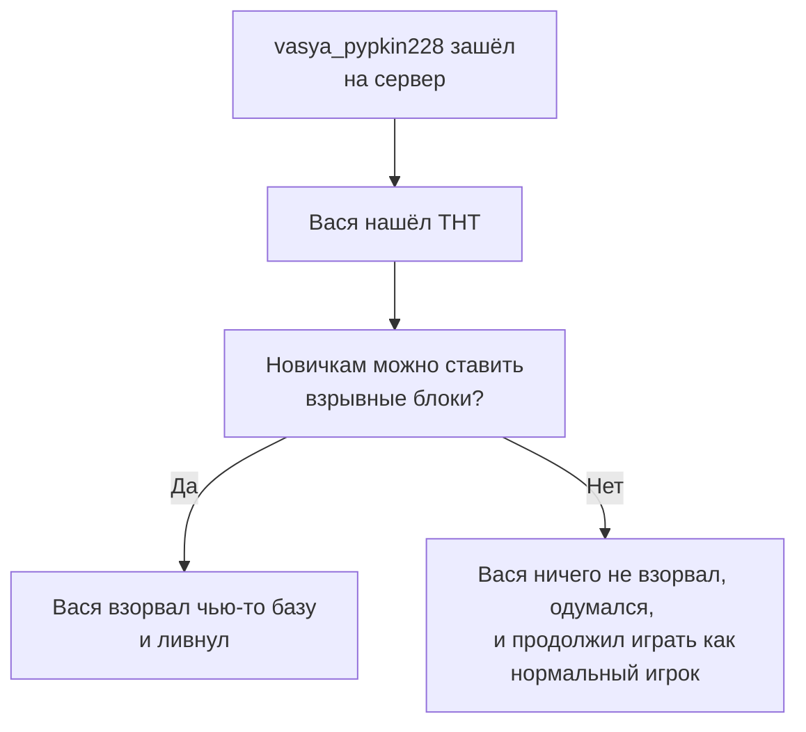

# Частые Вопросы

## Какая версия сервера? Пиратка или лицензия?

На момент **6** сезона - **1.21.1 Java**. Игра на Bedrock или PE издании, на данный момент, невозможна и не планируется.

Играть можно как с пиратки, так и с лицензии!
    
## Когда был вайп? Когда будет следующий?

Перед тем, как узнать дату вайпа, хотим тебе рассказать:

- Если ты волнуешься, что тебе не достанется лута - ванильные сундуки восстанавливаются раз в две недели

- Если ты волнуешься, что все структуры залутаны - они восстанавливаются время от времени админами

- Если ты волнуешься, что все игроки в топовых шмотках - аналогично будет и через неделю после вайпа

Поэтому не стоит сильно заострять внимание на дате вайпа =)

Вайп был 13 июля 2024. Дата следующего вайпа неизвестна никому.

## Как попасть на сервер?

Всё очень просто **и бесплатно** - нужно написать заявку в нашем [Дискорде](https://discord.gg/6f3FwFRJWC)!

Заявку нужно написать хорошую, объёмную, ведь именно так мы "фильтруем" недобросовестных игроков.

Если тебя не приняли - не переживай, ты всегда можешь написать новую, более хорошую заявку :з

## Какие размеры миров?

Обычный мир - **15000 х 15000**

Ад - **5000 х 5000**

Энд - **10000 х 10000**

## У вас есть приваты?

Нет! Единственный «приват» - новичкам запрещено разрушать Спавн и Незер-хаб и ставить взрывоопасные блоки в первые 10 часов игры.

После 10 часов все ограничения снимаются :3

## А что, если меня ограбят или загриферят?

Наши доблестные **Офицеры КСБ** помогут выявить нарушителя и он получит по заслугам!

Всё, что тебе нужно - отправить жалобу в нашем Дискорде. Полиция найдёт нарушителя и заставит выплатить тебе штраф или вернуть все вещи.

## Какая валюта сервера?

**АРы** - алмазная руда, в основном **глубиносланцевая**!

## А где мне можно строиться?

Везде, кроме Спавна!

Определение территории спавна прописано в наших законах, [вот здесь](http://127.0.0.1:8000/info/rules/laws/#1.4.%20правила%20территорий).

## Как создать клан/город/опг?

По сути - берёшь и создаёшь! Набираешь себе людей, РПшишь или делаешь что хочешь и всё.

Но если хочешь более официально, то придётся немного повозиться - подробнее об этом [по этой ссылке](../gameplay/unique/clans.md).

## Почему ''Кошкокрафт''? Вы ''няняня'' сервер для детей?

У этого названия есть целая история! Подробнее [по этой ссылке =)](../server-history/1season.md)

Но нет - мы не "сервер для детей". Мы сервер для **всех**!

## Почему мне запрещено ставить ТНТ, Кристаллы Энда и спавнить визера в первые 10 часов игры?

## Что за версии сервера? Что означает 6.x.x?

Первая цифра - **текущий сезон**,

Вторая цифра - **глобальные/большие** обновления,

Третья цифра - **минорные** патчи/обновления/фиксы,

Четвертая цифра - в редких случаях, **хотфиксы**.

Такой вот контроль версий!

## Что за сообщения GitHub в канале `#разработка-сервера`?

Это сообщения о том, что кто-то из админов что-то добавил на сервер разработки - локальный админский сервер для создания и тестирования обновлений.

Например, на картинке ниже написано `"Кастомные звуки теперь имеют субтитры"`. Это означает то, что кто-то из админов добавил такую фишку на сервер разработки и скоро она появится на основном сервере!

Ссылки в таких сообщениях открывать нельзя, потому что файлы Кошкокрафта - приватные =)

