# Спавн и Незер-хаб

Тут ты можешь узнать где что построено, где магазины, куда ходить и всё-всё-всё!

## Спавн

=== "Весь спавн"

    Спавн Кошкокрафта отмечен красными коврами.

    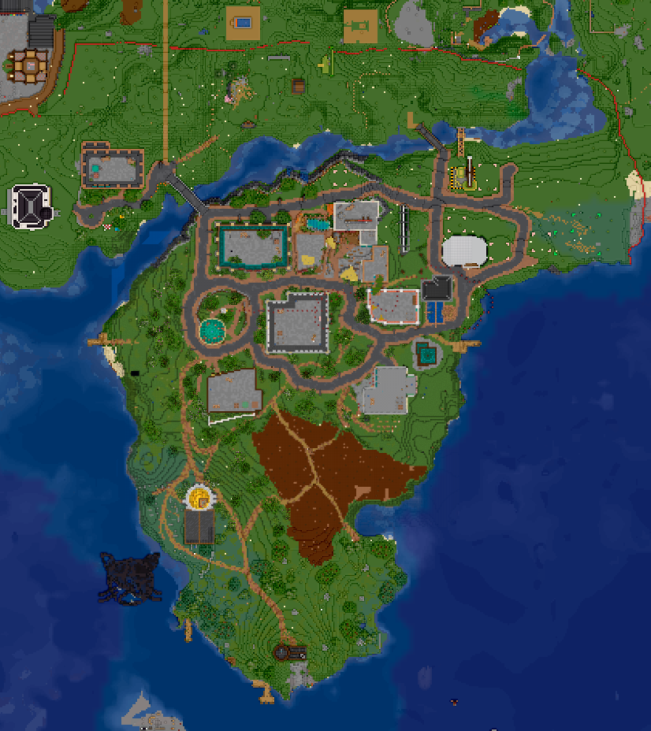{encoding="lazy" decoding="async"}

=== "Банк"

    Здесь можно пополнить/снять АРы.

    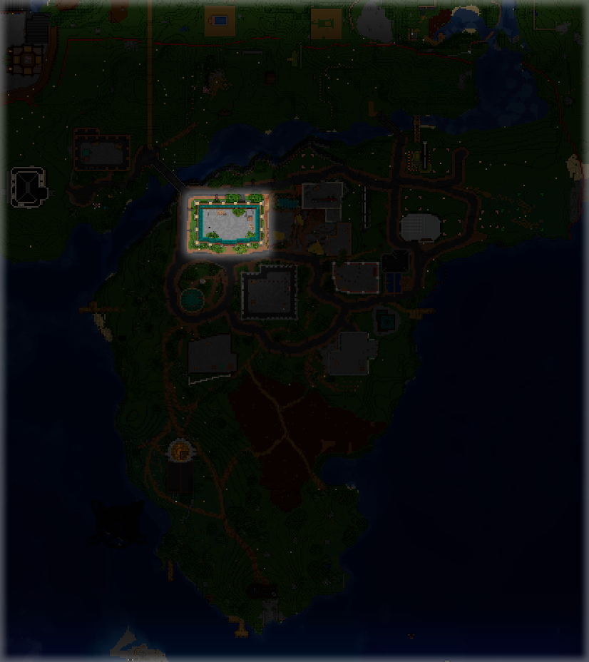{encoding="lazy" decoding="async"}

=== "Ферма"

    Здесь можно вскопать себе пшеницы. **Главное посади за собой обратно!**

    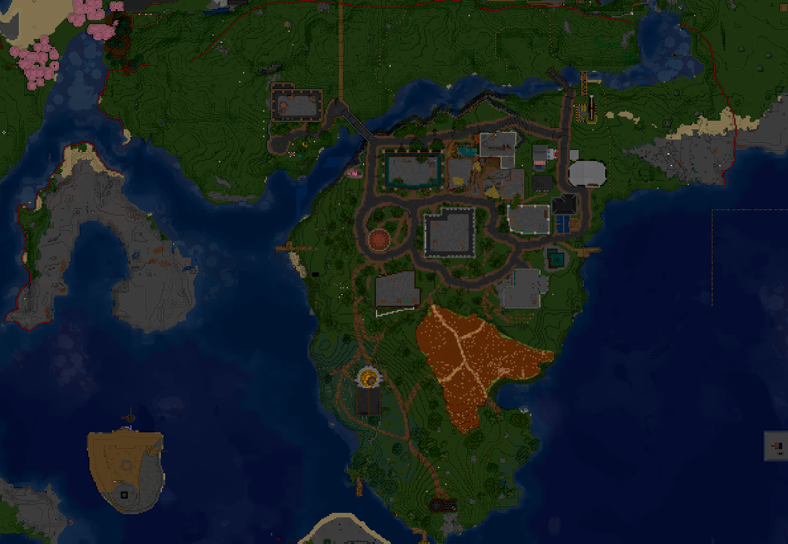{encoding="lazy" decoding="async"}

=== "Торговая зона"

    Здесь можно построить свой магазин. **Главное обсуди это с [Парламентом](../gameplay/roleplay/goverment.md)!**

    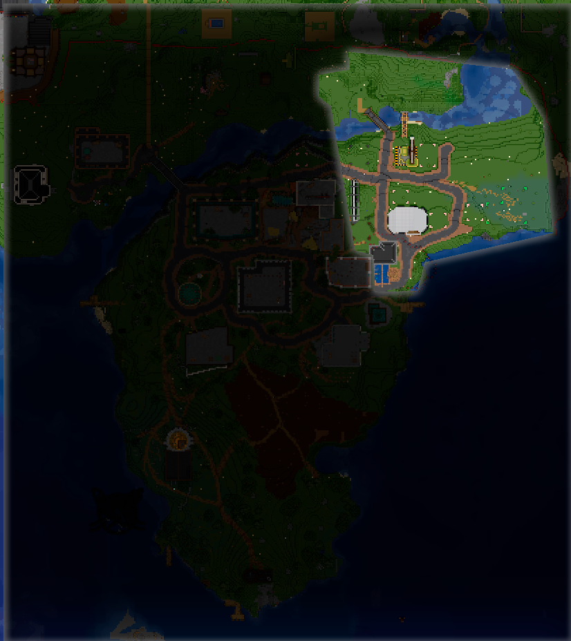{encoding="lazy" decoding="async"}

=== "Рыбак и маяк"

    Здесь можно продать рыбку Рыбаку.

    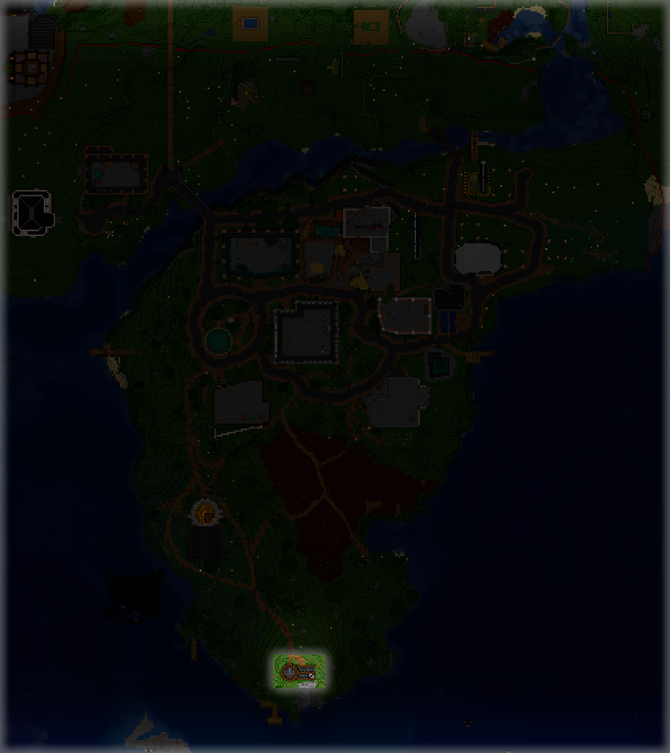{encoding="lazy" decoding="async"}

=== "Бар"

    Здесь можно взять квесты у Бармена и хорошо провести время.

    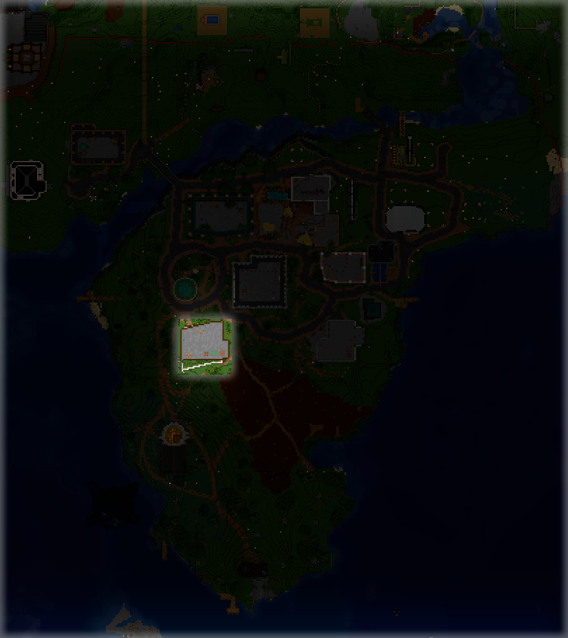{encoding="lazy" decoding="async"}

=== "Театр"

    Здесь можно провести или посмотреть на какое-нибудь выступление.

    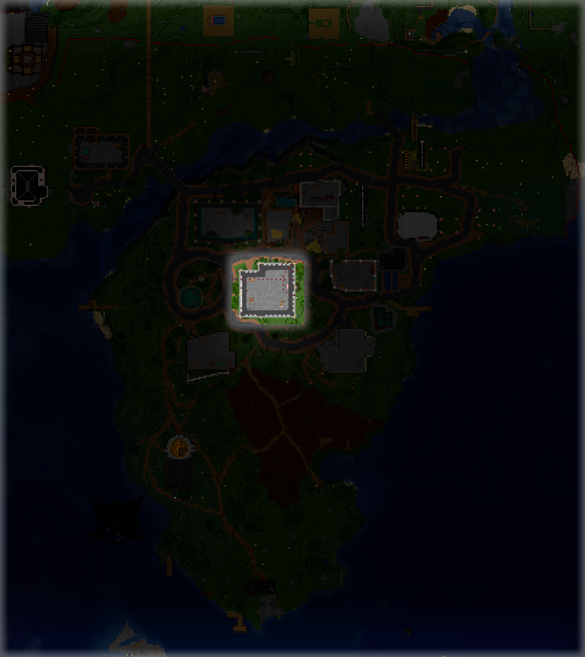{encoding="lazy" decoding="async"}

=== "Церковь"

    Здесь можно получить благословение у Священницы.

    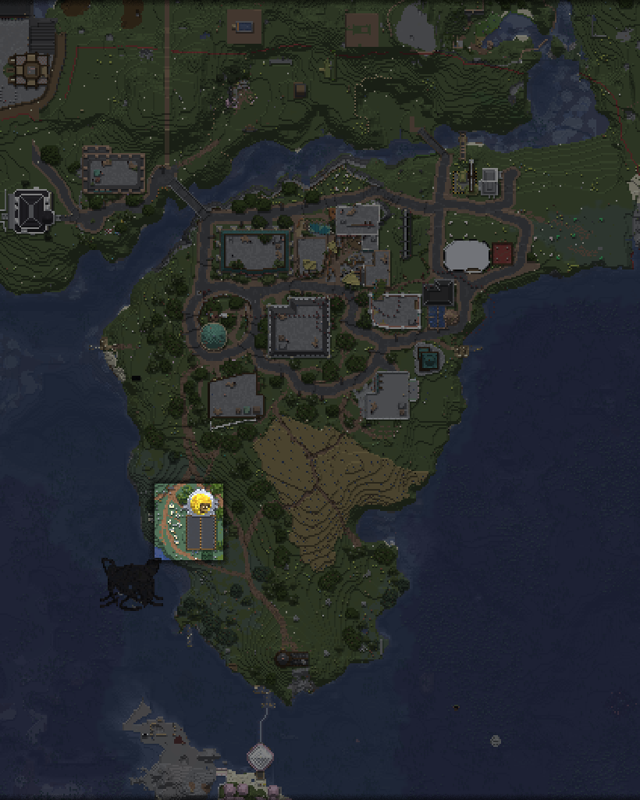{encoding="lazy" decoding="async"}

=== "Музыка"

    Здесь можно выжечь свою музыку на пластинке!

    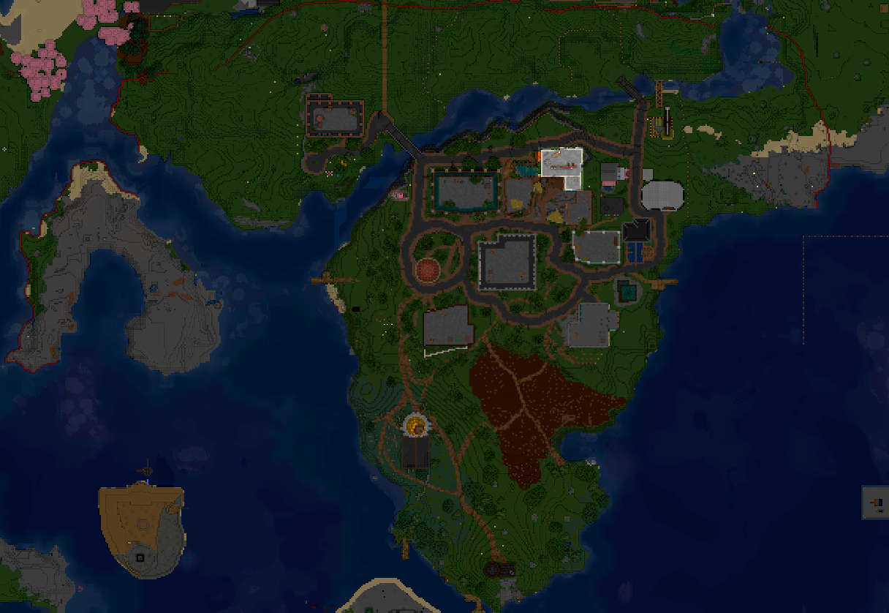{encoding="lazy" decoding="async"}

=== "Валера"

    Здесь можно посмотреть все [наборы обликов](donate.md)!

    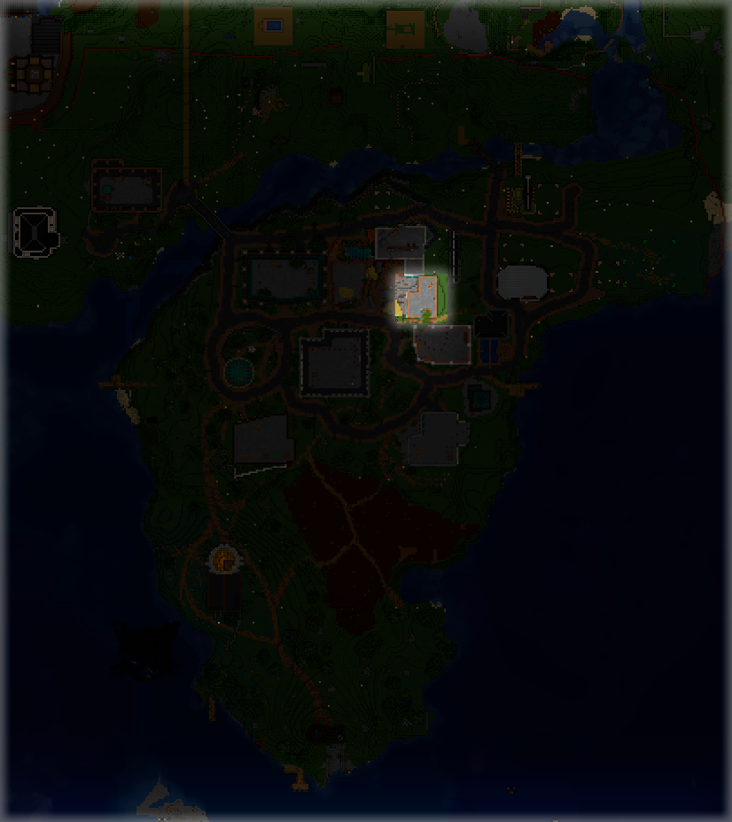{encoding="lazy" decoding="async"}

=== "Суд"

    Суд. Туд.

    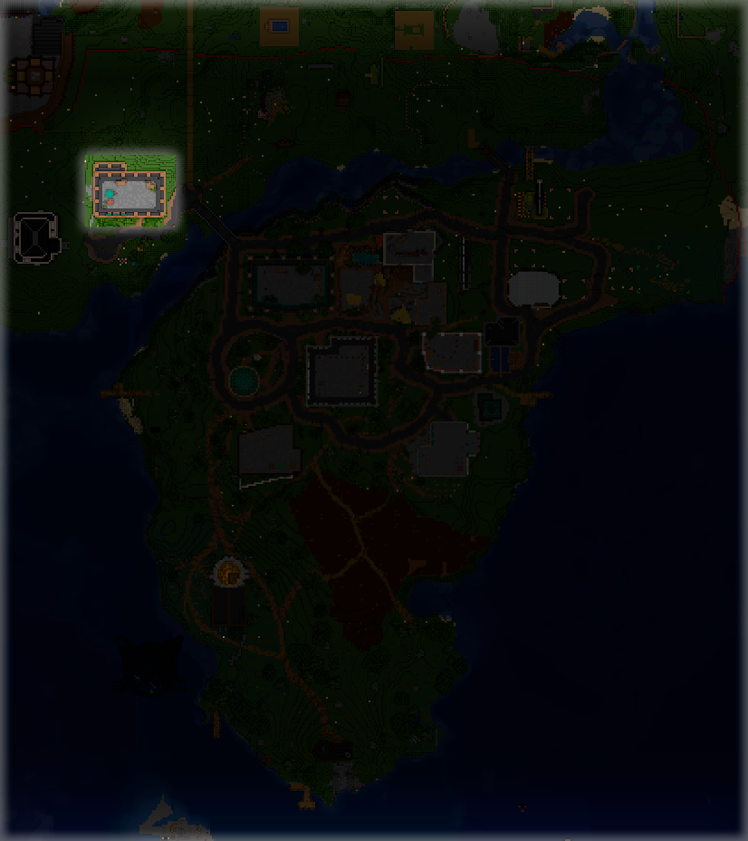{encoding="lazy" decoding="async"}

## Незер-хаб

Незер-хаба пока что нет!

## Энд-хаб

Энд-хаба пока что нет!
