# Локации Кошкокрафта

Тут ты можешь узнать где что построено, где магазины, куда ходить и всё-всё-всё!

## Спавн
=== "Столица"

    Столица Кошкокрафта!

    <figure markdown="span">
        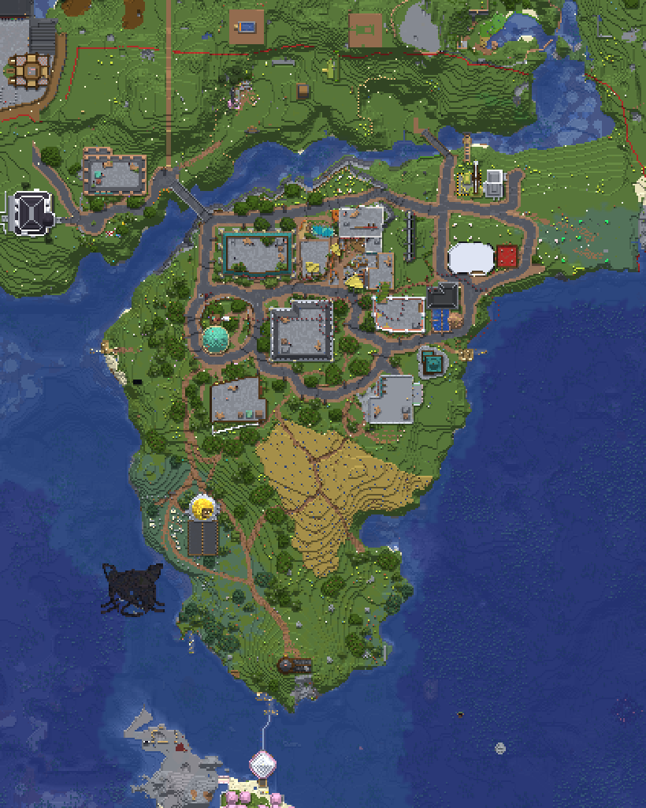{encoding="lazy" decoding="async" width=80%}
    </figure>

=== "Спавн"

    Собственно, спавн. Здесь всё и начинается.

    <figure markdown="span">
        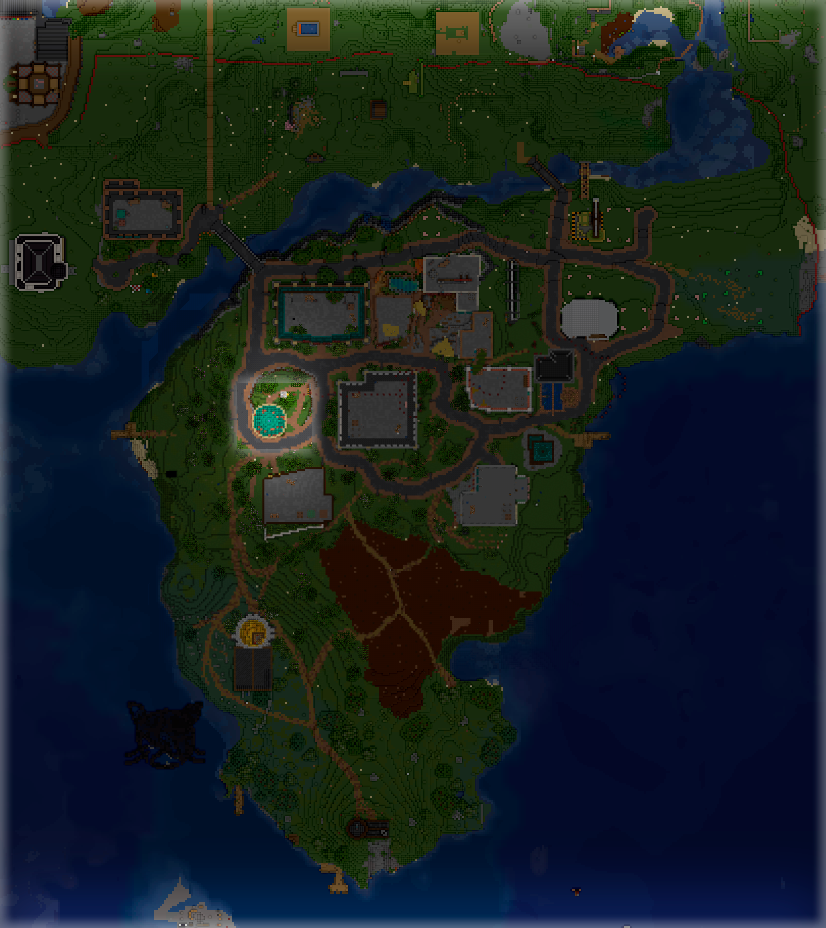{encoding="lazy" decoding="async" width=80%}
    </figure>

=== "Бар "Баюн""

    Здесь можно взять квесты у Бармена и хорошо провести время.

    <figure markdown="span">
        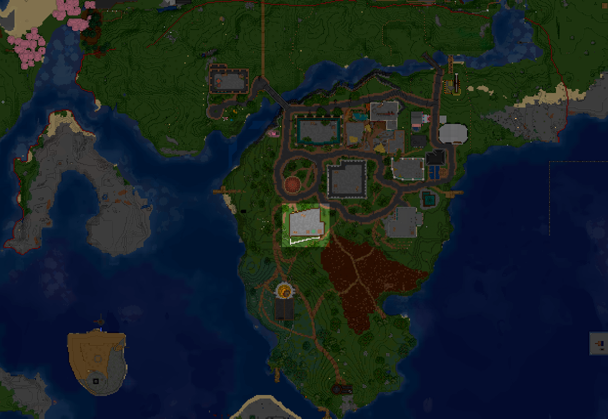{encoding="lazy" decoding="async" width=80%}
    </figure>

=== "Банк"

    Здесь можно пополнить/снять АРы.

    <figure markdown="span">
        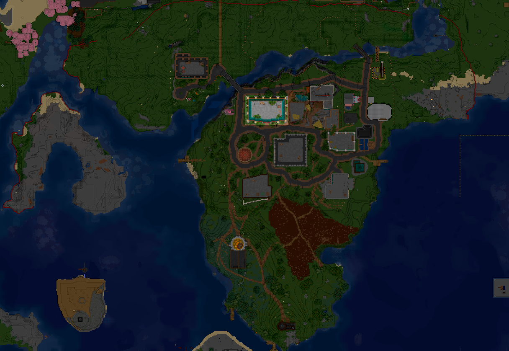{encoding="lazy" decoding="async" width=80%}
    </figure>

=== "Поле пшеницы"

    Благодаря священной земле, пшеница растёт сама по себе...

    <figure markdown="span">
        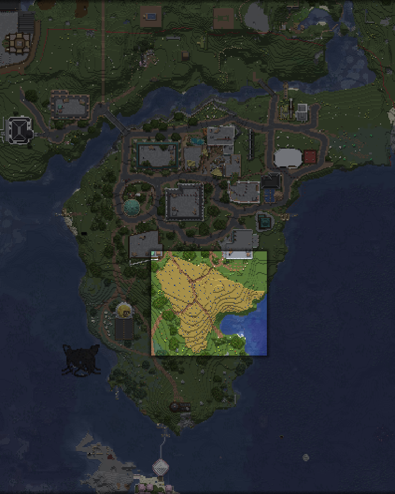{encoding="lazy" decoding="async" width=80%}
    </figure>

=== "Администрация"

    Здесь можно зарегистрировать клан или узнать о нём информацию у Администратора.

    <figure markdown="span">
        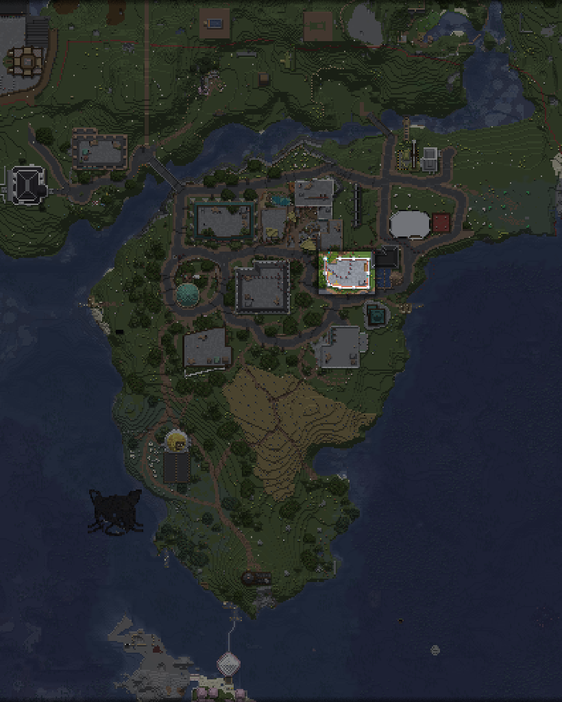{encoding="lazy" decoding="async" width=80%}
    </figure>

=== "Церковь"

    Здесь можно получить благословение у Священницы.

    <figure markdown="span">
        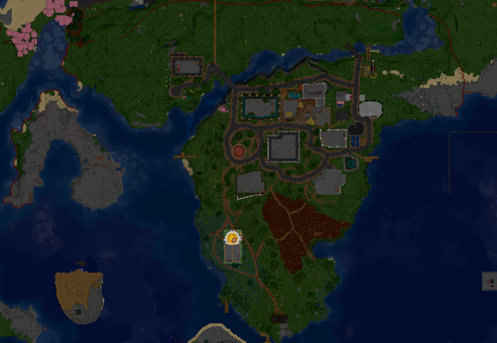{encoding="lazy" decoding="async" width=80%}
    </figure>

=== "Маяк"

    Здесь можно продать или обменять рыбку у Рыбака.

    <figure markdown="span">
        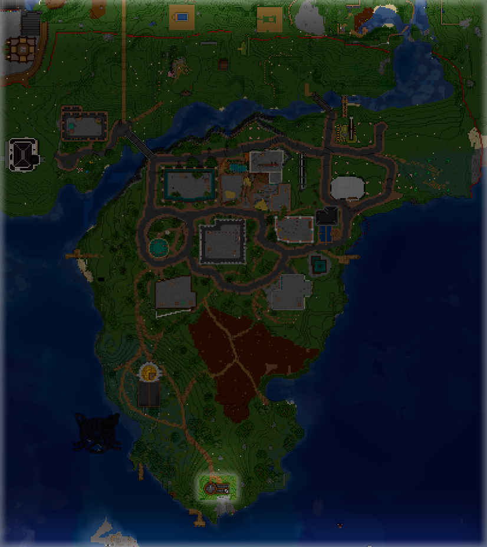{encoding="lazy" decoding="async" width=80%}
    </figure>

=== "Торговая зона"

    Здесь можно построить свой магазин. **Главное обсуди это с [Парламентом](../gameplay/roleplay/goverment.md)!**

    <figure markdown="span">
        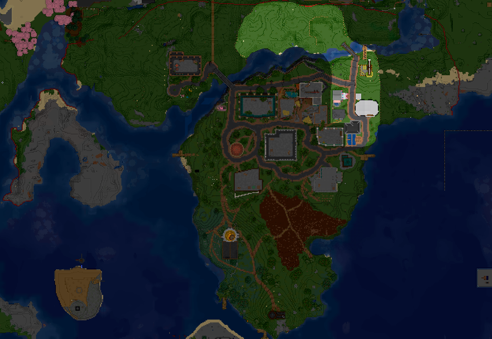{encoding="lazy" decoding="async" width=80%}
    </figure>

=== "Театр"

    Здесь можно провести или посмотреть на какое-нибудь выступление.

    <figure markdown="span">
        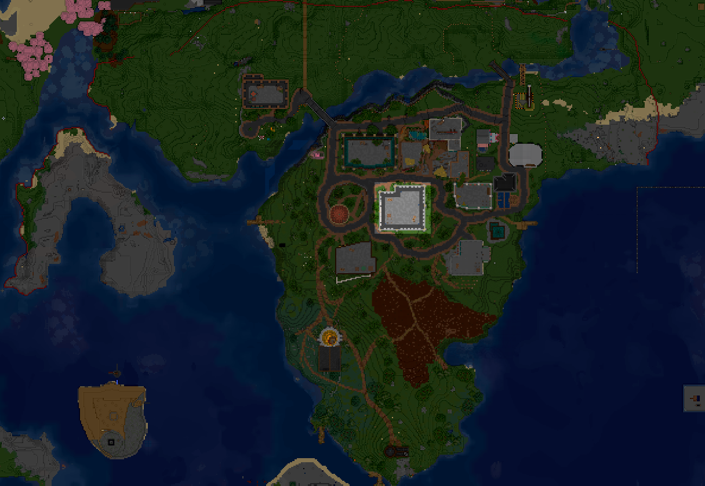{encoding="lazy" decoding="async" width=80%}
    </figure>

=== "Суд"

    Суд. Туд. Здесь решаются вопросы осуждённых котиков. Иногда.

    <figure markdown="span">
        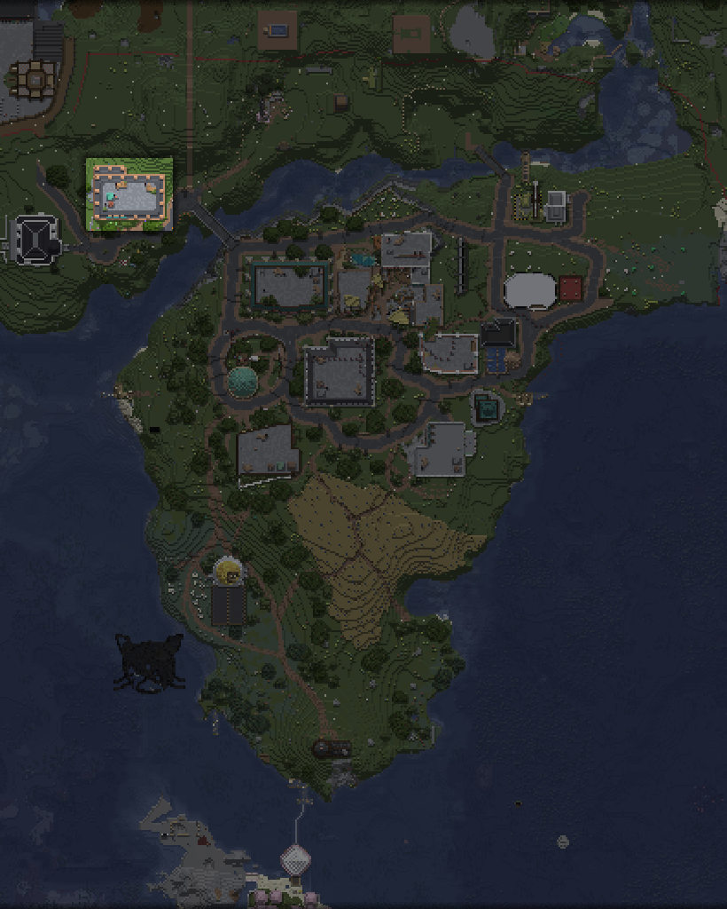{encoding="lazy" decoding="async" width=80%}
    </figure>

=== "Участок КСБ"

    Здесь проводят теоретические занятия для Кадетов. А в местном СИЗО отсиживают срок непослушные котики...

    <figure markdown="span">
        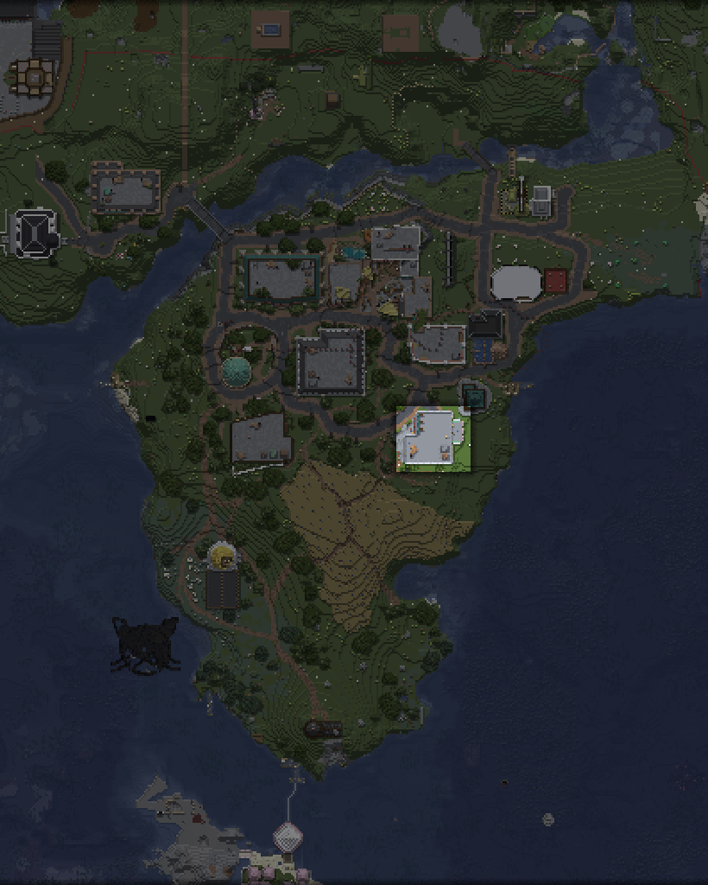{encoding="lazy" decoding="async" width=80%}
    </figure>

=== "Музыка"

    Здесь можно выжечь свою музыку на пластинке!

    <figure markdown="span">
        {encoding="lazy" decoding="async" width=80%}
    </figure>

=== "Валера"

    Здесь можно посмотреть все [наборы обликов](donate.md)!

    <figure markdown="span">
        {encoding="lazy" decoding="async" width=80%}
    </figure>

<!-- 

  

    

      
      
Столица Кошкокрафта!

    

    

      
      
Собственно, спавн. Здесь всё и начинается.

    

    

      
      
Бар "Баюн". Здесь можно взять квесты у Бармена и хорошо провести время.

    

    

      
      
Банк. Здесь можно пополнить/снять АРы.

    

    

      
      
Церковь при Всекотце. Здесь можно получить благословение у Священницы.

    

    

      
      
Административное здание. Здесь можно зарегистрировать клан или узнать о нём информацию у Администратора.

    

    

      
      
Маяк. Здесь можно продать или обменять рыбку у Рыбака.

    

    

      
      
Суд. Туд. Здесь решаются вопросы осуждённых котиков. Иногда.

    

    

      
      
Театр! Здесь можно провести или посмотреть на какое-нибудь выступление.

    

    

      
      
Музыкальный магазин. Здесь можно выжечь свою музыку на пластинке!

    

    

      
      
Участок КСБ. Здесь проводят теоретические занятия для Кадетов. А в местном СИЗО отсиживают срок непослушные котики...

    

    

      
      
Магазин Валеры. Здесь можно посмотреть все донатные наборы обликов!

    

    

      
      
Торговая зона. Здесь можно построить свой магазин. Главное обсуди это с Парламентом!

    

    

      
      
Общественное поле. Благодаря священной земле столицы, пшеница растёт сама по себе...

    

  

  <button class="carousel-button prev-button">&#10094;</button>
  <button class="carousel-button next-button">&#10095;</button>
  
1 / 3

 -->

## Незер-хаб

Незер-хаб в процессе строительства, на него можно взглянуть по координатам `0, 128+, 0` в Аду.

## Энд-хаб

Энд-хаба пока что нет!
