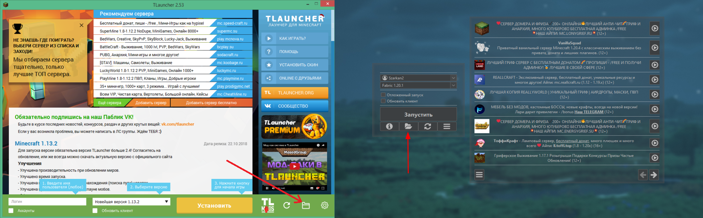
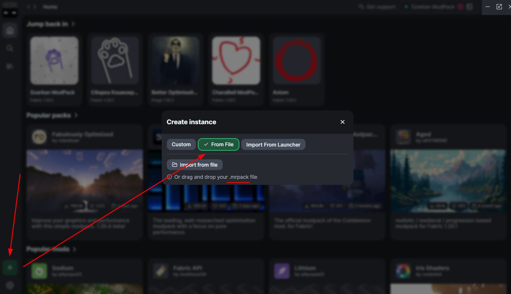

# Моды для сервера

## Моды

Для самого комфортного геймплея тебе нужно скачать **обязательные моды**. Они позволят полностью насладиться фишками нашего сервера!

-    __Как скачивать моды?__

    ---
    Мы написали гайд только для тебя! Он доступен по [этой ссылке](../../guides/mod_download)!

Если тебе лень скачивать все нужные моды для сервера - у нас есть [готовая сборка :material-download:](../assets/catcraft_1211_mods.zip) на **Fabric 1.21.1**!

-    __В неё входят__

    - **Куча** модов на оптимизацию! С ~45 ФПС до стабильных **150-250**!

    - Полезные моды (свет от факела в руке, зум камеры и т.д.)

    - Все обязательные для сервера моды

    - Вспомогательные моды для ресурспака, по типу его загрузки без экрана загрузки, просмотр всех переименований в наковальне и т.д.

    - Конфиги к модам, чтобы не настраивать всё по полчаса =)

    ??? tip "Полный список модов в сборке"
        <!-- Нет на 1.21 - [Animatica](https://modrinth.com/mod/animatica) -->
        - [Concurrent Chunk Management Engine](https://modrinth.com/mod/c2me-fabric)
        - [Customizable Player Models](https://modrinth.com/plugin/custom-player-models)
        - [[EMF] Entity Model Features](https://modrinth.com/mod/entity-model-features)
        - [[ETF] Entity Texture Features](https://modrinth.com/mod/entitytexturefeatures)
        - [Entity Culling](https://modrinth.com/mod/entityculling)
        - [EmoteCraft](https://modrinth.com/plugin/noemotecraft)
        - [Falling Leaves](https://modrinth.com/mod/fallingleaves)
        <!-- Нет на 1.21 - [fast-ip-ping](https://modrinth.com/mod/fast-ip-ping) -->
        - [FastQuit](https://modrinth.com/mod/fastquit)
        - [FerriteCore](https://modrinth.com/mod/ferrite-core)
        - [ImmediatelyFast](https://modrinth.com/mod/immediatelyfast)
        - [Indium](https://modrinth.com/mod/indium)
        - [Iris Shaders](https://modrinth.com/mod/iris)
        - [Krypton](https://modrinth.com/mod/krypton)
        <!-- Нет на 1.21 - LambDynamicLights (В сборке самодельная, портированная версия) -->
        - [Language Reload](https://modrinth.com/mod/language-reload)
        <!-- Нет на 1.21 - [LazyDFU](https://modrinth.com/mod/lazydfu) -->
        - [Lithium](https://modrinth.com/mod/lithium)
        - [ModernFix](https://modrinth.com/mod/modernfix)
        - [Mod Menu](https://modrinth.com/mod/modmenu)
        <!-- Лагает на 1.21 + это всё равно на сервере есть - [No Chat Reports](https://modrinth.com/mod/no-chat-reports) -->
        - [Text Placeholder API](https://modrinth.com/mod/placeholder-api)
        - [Plasmo Voice](https://modrinth.com/plugin/plasmo-voice)
        - [Reese's Sodium Options](https://modrinth.com/mod/reeses-sodium-options)
        - [Remove Reloading Screen](https://modrinth.com/mod/rrls)
        - [Sodium](https://modrinth.com/mod/sodium)
        - [Sodium Extra](https://modrinth.com/mod/sodium-extra)
        - [Shulker Box Tooltip](https://modrinth.com/mod/shulkerboxtooltip)
        - [ThreadTweak](https://modrinth.com/mod/threadtweak)
        - [Very Many Players](https://modrinth.com/mod/vmp-fabric)
        - И библиотеки для модов

## Гайд по установке

??? tip "Для ванильного лаунчера, TL, TLegacy и прочих"
    1. [Скачиваешь архив :material-download:](../assets/catcraft_1211_mods.zip)

    2. Открываешь папку **игры**
        
        - Открыть папку игры можно нажав ++win+r++, написав `%appdata%` и перейдя в папку `.minecraft`
        
        - Или нажав в лаунчере иконку **папки**, она есть почти везде { width=750 }
    
    3. Открываешь архив 

        - Для этого нужно иметь установленный архиватор, советуем [7-Zip](https://ru.wikipedia.org/wiki/7-Zip)
    
    4. Перекидываешь папку `mods` из архива в папку `.minecraft` или в папку своей версии

??? tip "Для MultiMC, ModrinthApp, PrismLauncher и т.п."
    1. [Скачиваешь файл .mrpack :material-download:](../assets/catcraft_1211_mods.mrpack)

    2. Создаёшь новую сборку

    3. В настройках сборки выбираешь пункт "Импортировать из файла" или что-то похожее { width=650 }

    `.mrpack` это файл всей сборки в... одном файле. И конфиги, и иконка, и моды, и всё всё всё!

***

## Рекомендуемые моды

Моды из этого списка необязательны, но думаю ты сможешь найти что-то, что тебе зайдёт! Все моды из списка протестированы!

Гайд по скачиванию модов есть [по этой ссылке](../../guides/mod_download.md)!

??? tip "Оптимизация"

    Майнкрафт не славится своей оптимизацией - даже на самых сильных компах ФПС может быть низким. Но эти моды увеличат эту цифру в **пять** раз!

    Все эти моды уже встроены в нашу [готовую сборку](#моды)!

    

    -    __Sodium__

        ---
        { align=right width="100" }
        Это база! Общая оптимизация игры более чем в три раза!

        [:octicons-arrow-right-24: Перейти на сайт мода](https://modrinth.com/mod/sodium)

    -    __FerriteCore__

        ---
        { align=right width="100" }
        Тоже база! Оптимизация оперативной памяти в игре.

        [:octicons-arrow-right-24: Перейти на сайт мода](https://modrinth.com/mod/ferrite-core)

    -    __Iris__

        ---
        { align=right width="100" }
        Шейдеры в игре + общая оптимизация!

        [:octicons-arrow-right-24: Перейти на сайт мода](https://modrinth.com/mod/iris)

    -    __lazyDFU__

        ---
        { align=right width="100" }
        Оптимизация запуска игры!

        [:octicons-arrow-right-24: Перейти на сайт мода](https://modrinth.com/mod/lazydfu)

    -    __Lithium__

        ---
        { align=right width="100" }
        Оптимизация многих аспектов игры - от ИИ до физики игры!

        [:octicons-arrow-right-24: Перейти на сайт мода](https://modrinth.com/mod/lithium)

    -    __Language Reload__

        ---
        { align=right width="100" }
        Позволяет менять язык игры за миллисекунду!

        [:octicons-arrow-right-24: Перейти на сайт мода](https://modrinth.com/mod/language-reload)

    -    __Very Many Players__

        ---
        { align=right width="100" }
        Полезный мод на серверах - при большом скоплении игроков он оптимизирует игру!

        [:octicons-arrow-right-24: Перейти на сайт мода](https://modrinth.com/mod/vmp-fabric)

    -    __Fast Quit__

        ---
        { align=right width="100" }
        Оптимизация выхода из миров, серверов и игры в целом!

        [:octicons-arrow-right-24: Перейти на сайт мода](https://modrinth.com/mod/fastquit)

    -    __To be continued...__

    

??? tip "Полезности"
    

    -    __RP Renames__

        ---
        { align=right width="100" }
        Очень полезный мод для нашего сервера - позволяет посмотреть все переименования предметов в наковальне!

        [:octicons-arrow-right-24: Перейти на сайт мода](https://modrinth.com/mod/rp-renames)

    -    __AdvancementInfo__

        ---
        { align=right width="100" }
        Мод, улучшающий окно достижений! Он увеличивает это окно, показывает что ещё требуется для выполнение достижение и делает форматирование более удобным!
        
        [:octicons-arrow-right-24: Перейти на сайт мода](https://modrinth.com/mod/advancementinfo)

    -    __Better Statistics Screen__

        ---
        { align=right width="100" }
        Мод, улучшающий окно статистики - показывает детальную информацию в очень красивом меню!
        
        [:octicons-arrow-right-24: Перейти на сайт мода](https://modrinth.com/mod/better-stats)

    -    __Chat Patches__

        ---
        { align=right width="100" }
        Многофункциональный мод для чата - позволяет добавлять к сообщениям временные метки, увеличивает историю сообщений, позволяет копировать любое сообщение из чата и многое другое!
        
        [:octicons-arrow-right-24: Перейти на сайт мода](https://modrinth.com/mod/chatpatches)

    -    __Symbol Chat__

        ---
        { align=right width="100" }
        Добавляет менюшку с разными символами, эмодзи и смайликами! Также позволяет писать разными шрифтами.
        
        [:octicons-arrow-right-24: Перейти на сайт мода](https://modrinth.com/mod/symbol-chat)

    -    __Inventory Profiles Next__

        ---
        { align=right width="100" }
        Многофункциональный мод для инвентаря - блокировка слотов, сортировка инвентаря, авто-замена предмета, если он ломается и многое другое!
        
        [:octicons-arrow-right-24: Перейти на сайт мода](https://modrinth.com/mod/inventory-profiles-next)

    -    __AuthMe__

        ---
        { align=right width="100" }
        Мод, позволяющий прямо в игре менять свой ник - по моджангу, по майкрософту или по пиратке.
        
        [:octicons-arrow-right-24: Перейти на сайт мода](https://modrinth.com/mod/auth-me)

    -    __DeathLog__

        ---
        { align=right width="100" }
        Запись инвентаря, координат, времени и причины смерти! Очень полезно для нашего сервера для предостовления пруфов!
        
        [:octicons-arrow-right-24: Перейти на сайт мода](https://modrinth.com/mod/deathlog)
        
    -    __Remove Reloading Screen__

        ---

        { align=right width="100" }
        Мод, позволяющий играть во время загрузки ресурспаков!
        
        [:octicons-arrow-right-24: Перейти на сайт мода](https://modrinth.com/mod/rrls)

    -    __To be continued...__

    

??? tip "Красота"
    

    
    -    __Distant Horizons__

        ---
        { align=right width="100" }
        Благодаря этому моду ты можешь играть на любой прорисовке **даже на сервере**! Дальние чанки никак не нагружают систему, т.к. они являются фейковыми и рендерятся в слабом качестве. Для использования на сервере достаточно побегать по миру, и чанки сами загрузятся!
        
        [:octicons-arrow-right-24: Перейти на сайт мода](https://modrinth.com/mod/distanthorizons)

        ---

        

    -    __Explosive Enhancement__

        ---
        { align=right width="100" }
        Мод, делающий взрывы в игре более красивыми и объёмными. Даже взрывы под водой!
        
        [:octicons-arrow-right-24: Перейти на сайт мода](https://modrinth.com/mod/explosive-enhancement)

        ---

        

    -    __Falling Leaves__

        ---
        { align=right width="100" }
        Мод, добавляющий падающую листву ко всем деревьям!
        
        [:octicons-arrow-right-24: Перейти на сайт мода](https://modrinth.com/mod/fallingleaves)
        
        ---

        

    -    __Wakes__

        ---
        { align=right width="100" }
        Мод, добавляющий след от лодок или игрока при плавании!
        
        [:octicons-arrow-right-24: Перейти на сайт мода](https://modrinth.com/mod/wakes)

        ---

        

    -    __Not Enough Animations__

        ---
        { align=right width="100" }
        Мод, добавляющий различные анимации игрока для разных действий - ползание по лестнице, карабкание, книга в руках и прочее!
        
        [:octicons-arrow-right-24: Перейти на сайт мода](https://modrinth.com/mod/not-enough-animations)

        ---

        

    -    __Better Clouds__

        ---
        { align=right width="100" }
        Мод, заменяющий скучные ванильные облака на процедурно-генерируемые 3D облака! Их вид можно настроить как-угодно!
        
        [:octicons-arrow-right-24: Перейти на сайт мода](https://modrinth.com/mod/better-clouds)

        ---

        

    -    __To be continued...__

    

??? tip "Съёмка"
    

    -    __Fabrishot__

        ---
        { align=right width="100" }
        Мод, позволяющий снимать скриншоты в 4К!
        
        [:octicons-arrow-right-24: Перейти на сайт мода](https://modrinth.com/mod/fabrishot)

    -    __Replay Mod__

        ---
        { align=right width="100" }
        База съёмки - позволяет делать запись видео **всего вокруг** и редактировать запись внутри игры!
        
        [:octicons-arrow-right-24: Перейти на сайт мода](https://modrinth.com/mod/replaymod)

    -    __To be continued...__
    
    
