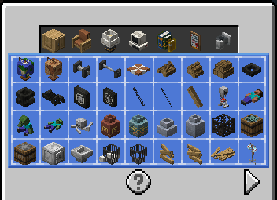
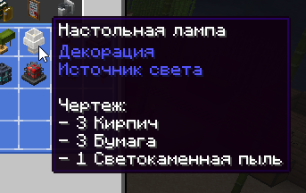

# Стол декора

!!! tip inline end "Предмет"
    <figure markdown="span">
        { width=150 }
    </figure>
    ***
    **Тип:** Блок
    ***
    **Получение:**
    
    - Крафт
    ***
    **Текстура by:** bykkake747
    ***
    **Идея by:** bykkake747

**Стол декора** - особый верстак для крафта декораций

!!! info "Декорации"
        Декор - особые "блоки", чья роль исключительно косметическая, для украшения окружения. 
        Зачастую не имеют особого функционала.

        TODO - сделать отдельную страничку в разделе Геймплей

***

## Использование

При взаимодействии открывает меню с рецептами расставленными по категориям.

{ width=600}

Рецепты не требуют сетки крафта, а только кол-во некоторых ресурсов

{ width=600}

***
## Крафт

{ width=400}