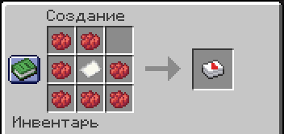

# Игральные карты

!!! tip inline end "Предмет"
    <figure markdown="span">
        { width=150 }
    </figure>
    ***
    **Тип:** Предмет
    ***
    **Получение:**
    
    - Крафт
    ***
    **Текстура by:** bykkake747
    ***
    **Идея by:** bykkake747

**Игральные карты** - классический набор из 52 карт. Карта и масть не отображаются со стороны и видны только у того, кто их держит.
Карты можно ставить на любую поверхность.

## Крафт

Карты можно получить, распаковав **Колоду** определённой масти. Чтобы распаковать **Колоду** нужно нажать <kbd>ПКМ</kbd>, держа колоду в руках.

- 

    <figure markdown="span">
        { align=right width="400" }
        <figcaption>Колода крести</figcaption>
    </figure>

- 

    <figure markdown="span">
        { align=right width="400" }
        <figcaption>Колода пик</figcaption>
    </figure>

- 

    <figure markdown="span">
        { align=right width="400" }
        <figcaption>Колода черви</figcaption>
    </figure>

- 

    <figure markdown="span">
        { align=right width="400" }
        <figcaption>Колода бубны</figcaption>
    </figure>

- 

    <figure markdown="span">
        { align=left width="400" }
        <figcaption>Джокер</figcaption>
        <figcaption>Крафтится отдельно</figcaption>
    </figure>

