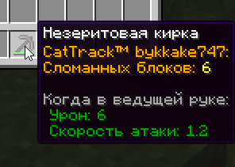

# Модуль CatTrack

!!! tip inline end "Предмет"
    <figure markdown="span">
        { width=150 loading="lazy" decoding="async" }
    </figure>
    ***
    **Тип:** Накладываемое
    ***
    **Получение:**
    
    - Странствующий торговец
    ***
    **Текстура by:** bykkake747
    ***
    **Идея by**: Szarkan

**Модуль CatTrack** - накладываемый предмет на инструменты (кроме мотыги), оружие, трезубец и броню.

***

При наложении, обновляет описание предмета в соответствии с типом:

- У инструментов показывает кол-во сломанных блоков

- У оружия показывает кол-во убитых существ и игроков

- У брони показывает кол-во поглощенного урона

***

## Как наложить?

- Взять CatTrack в инвентаре

- Кликнуть им на нужный предмет в инвентаре

***

## Скриншоты

- 

    <figure markdown="span">
        { align=right width="350" }
        <figcaption>Пример с мечом</figcaption>
    </figure>

- 

    <figure markdown="span">
        { align=right width="350" }
        <figcaption>Пример с киркой</figcaption>
    </figure>

