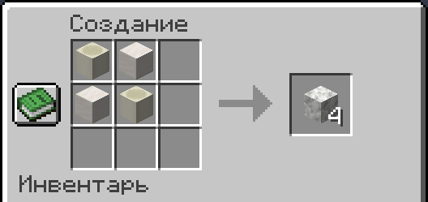

# Изменения крафтов

На кошкокрафте добавлены или расширены крафты некоторых ванильных предметов. Это сделано для упрощения в получении или возможности использования контента, раннее недоступного в ванилле.

## Чёрный краситель

!!! tip inline end "Предмет"
    <figure markdown="span">
        { width=150 }
    </figure>
    ***
    **Тип:** Предмет
    ***
    **Получение:**
    
    - Крафт

Предмет, который используются для изменения цвета шерсти, кожаной брони, терракоты и многого другого.

Чёрный, как один из самых популярных цветов, является востребованным, но добывать краситель без сложных ферм - долго. Потому был добавлен крафт из более доступных ресурсов.

### Крафт

Подходит как обычный, так и древесный уголь.

{ width=400 loading="lazy" decoding="async" }

***

## Кальцит

!!! tip inline end "Предмет"
    <figure markdown="span">
        { width=150 }
    </figure>
    ***
    **Тип:** Блок
    ***
    **Получение:**
    
    - Крафт

Ванильный блок, генерирующийся в аметистовых жеодах и горах.

По причине относительной редкости на текущей генерации, и большой востребованности в строительстве, был добавлен его крафт.

### Крафт

- 2 Костных блока

- 2 Кварцевых блока

{ width=400 loading="lazy" decoding="async" }

***

## Укреплённый глубинный сланец

!!! tip inline end "Предмет"
    <figure markdown="span">
        { width=150 }
    </figure>
    ***
    **Тип:** Блок
    ***
    **Получение:**
    
    - Крафт

По характеристикам схож с обсидианом, но ломается гораздо дольше и не выпадает при поломке даже с "Шёлковым касанием". Находится в **Древнем городе**, но добыть его нельзя, поэтому и был добавлен крафт.

### Крафт

- 8 глубинного сланца

- 1 древний обломок

{ width=400 loading="lazy" decoding="async" }

***

## Мешок

!!! tip inline end "Предмет"
    <figure markdown="span">
        { width=150 }
    </figure>
    ***
    **Тип:** Предмет
    ***
    **Получение:**
    
    - Крафт

У мешка похожая механика с **Шалкерами**, но в него можно положить лишь **1 стак** предметов одного типа. Например: 16 снежков, 64 камня, 1 меч. Всё это - 1 стак предметов.

Можно класть какие-угодно предметы одного типа, пока их количество в мешке меньше стака: 24 ромашки + 14 тюльпанов + 26 маков = 64 цветочка в целом

### Крафт

- 8 Кроличьих шкурок

- 1 Нитка

{ width=400}