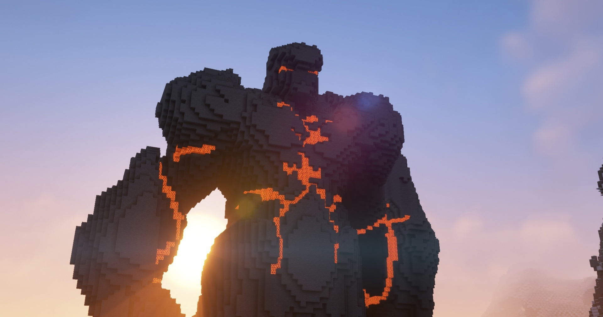

# 2 сезон

!!! warning ""
    Статья написана в основном по постам из ВК, по памяти админа и по некоторым диалогам с игроками. 

    Статья незавершена, если у тебя есть информация о событиях и датах данного сезона - пиши в ЛС админу!

!!! warning "Для украинцев"
    Если ты с Украины, то возможно у тебя не будут грузиться картинки! Это связано с тем, что они взяты напрямую из ВК. Если так оно и есть - используй VPN :)

## 15 марта 

Новый сезон! 

- Были добавлены разные мелкие фишки и обновлены напитки

- Карта была сброшена

- Вайтлист также был сброшен, но попадание на сервер не поменялось

- Примерно в это же время игроки StCrouse и Liberaha получили ОПки, т.к. были игроками с большим доверием к ним и в целом помогали серверу развиваться.

{ width=75% decoding="async" loading="lazy" }

## 18 марта

На сервер попал dimastein. Очень важная персона в истории Кошкокрафта, больше о нём и его клане будет в 3 сезоне

## 19-21 марта

- Игроком EZENMYR было запущено строительство спавна - <https://vk.com/wall-210306238_158>

- Игроком EZENMYR был построен макет Незер-хаба - более крутого, чем на прошлом сезоне - <https://vk.com/wall-210306238_163>

- Игроком EZENMYR был основана империя - <https://vk.com/wall-210306238_165>

## 22 марта
- Был запущен ивент с ещё одним мини-боссом - Иллюзионером! <https://vk.com/wall-210306238_178>

    { width=75% decoding="async" loading="lazy" }

- В этот же день хостинг слёг и сервер был оффлайн целый день

## 24-30 марта

- Был снят охуенный трейлер Незер-хаба <https://vk.com/wall-210306238_187>

<iframe src="https://vk.com/video_ext.php?oid=-210306238&id=456239023&hd=2" width="853" height="480" allow="autoplay; encrypted-media; fullscreen; picture-in-picture;" frameborder="0" allowfullscreen></iframe>

- Было запущено его строительство - <https://vk.com/wall-210306238_240>

## 1 апреля

- Сервер сменился на анархо-гриф-дюп-пвп <https://vk.com/wall-210306238_279>

- Все донаты изменились и подешевели <https://vk.com/wall-210306238_281>

- Были добавлены кастомные сообщения о смерти

## 7-26 апреля

- Снова добавили онлайн-карту <https://vk.com/wall-210306238_318>

- Была добавлена возможность менять себе цвет ника для донатиров <https://vk.com/wall-210306238_320>

- Были добавлены невидимые рамки

- Сменили анти-иксрей на менее лагучий

- Сервер сменился на 1.18.2

- Группа набрала 200 подписчиков

## 2 мая

- Первое открытие дискорда Кошкокрафта - <https://vk.com/wall-210306238_374>

    - Ссылка ведёт уже на удаленный дискорд канал, но он был до начала 5 сезона! И зачем он его удалил?...

- Также был отсроен Энд-хаб игроком Lofiry - очень красивый и часто использовался в рекламе сервера - <https://vk.com/wall-210306238_377>

    { width=75% decoding="async" loading="lazy" }

## 3 мая

- Был куплен второй сервер, на который сначала загрузили карту 1 сезона

    - Далее на него был загружен оригинальный скайблок

- Как минимум у 5 игроков на тот момент была ОПка - у самых старых и заслуживающих уважения игроков

{ width=75% decoding="async" loading="lazy" }

## 12-30 мая

- Было потрачено впустую 2 дня, зато был создан модифицированный датапак BlazeAndCaves без мусорных достижений, а также набор серверных достижений <https://vk.com/wall-210306238_408>

    - В итоге, на момент 5 сезона, все "мусорные" достижения были возвращены.

- Был построен охуенный гигант на спавне игроком God_of_hentai. Эту постройку вы тоже могли часто видеть <https://vk.com/wall-210306238_441>

{ width=75% decoding="async" loading="lazy" }

- Серверу исполнилось полгода <https://vk.com/wall-210306238_491>

- Был отсроен первый город ФырCUMск, глава которого был dimastein

## Июнь 

- Был проведён ивент Захват замка игроками Asp1re и dimastein <https://vk.com/wall-210306238_585>

- Была подготовка в вайпу и новому сезону

- Сезон закончился 27 июня 2022 года. Карта мира утеряна.

## Альбом 2 сезона

[:simple-vk: Ссылка](https://vk.com/album-210306238_283207236){ .md-button .md-button--primary }

