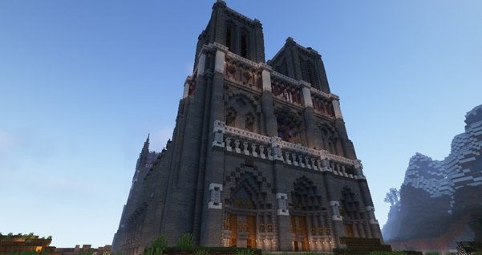

# 3 сезон

!!! warning ""
    Статья написана в основном по постам из ВК, по памяти админа и по некоторым диалогам с игроками. 

    Статья незавершена, если у тебя есть информация о событиях и датах данного сезона - пиши в ЛС админу!

    Помогали:

    Skorohodon - помог картинками и дополнил новости из беседы

    CharaBell (на момент 3 сезона - ClaraBell) - напомнила о некоторых событиях

!!! warning "Для украинцев"
    Если ты с Украины, то возможно у тебя не будут грузиться картинки! Это связано с тем, что они взяты напрямую из ВК. Если так оно и есть - используй VPN :)

## 28 июня

- Был запущен 3 сезон Кошкокрафта <https://vk.com/wall-210306238_600>

- Был добавлен кастомный ресурспак

- Были обновлены достижения сервера

- Добавлен плагин на кастомную рыбу (не рыбалку). Много рыб осталось ещё с тех времён.

- Был обновлён чат - более красивое оформление, команды по типу [pos], [ping] и т.д., добавлены стикеры в чате

- Начало какого-никакого РП - правила, суды, законы, начало CatPass

- Новые напитки и их текстуры, обновление ВК бота и добавление команды "кто"

- Попасть на сервер можно было только написав заявку и ответив на вопросы в ней

- Новые патчи и обновления теперь выпускались не постами, а статьями

{ width=75% decoding="async" loading="lazy" }

## 1-2 июля

- Соревнование рыбалки на целый день. Призы - 32, 16 и 8 АБ за 1, 2 и 3 места соответственно.

- Различные баг-фиксы, вернулась онлайн-карта

## 3 июля

Были проведены прятки на отдельной крутой карте

Победителей не было, но зато круто провели время

{ width=75% decoding="async" loading="lazy" }

## 5 июля

- Были добавлены медали - префиксы перед ником за разные достижения - строительство, поиск багов, крутые идеи. Сейчас это заменено CatPass - <https://vk.com/wall-210306238_650>

- В этот же день dimastein, цитирую, замечает одного игрока в лодке, который, по информации друга, построил и туннель из спавна и мост вниз. Оказалось что это девушка с ником ClaraBell. В этот же день dimastein узнал о том, что она хочет к нему в клан, и он её успешно принял к себе.

##9 июля

- Была объявлена пятая олимпиада Кошкокрафта! Участие было сделано через вк-бота, а награды снижены.

## 10-14 июля - Начало спавна

- Построена церковь на спавне игроком **ytrbqdkflbvbhy**

    - Оказывается его ник - "некийвладимирн" на английской раскладке

- Построен мост игроком CharaBell

    - Потом она была отругана за то, что мост был не очень красивый. В итоге она его перестроила. А в конечном итоге мы с ней женаты :D

- Были добавлены три новых напитка и достижение "Вместо доната"

- Добавлено логирование инвентарей, теперь их можно восстанавливать

- Гигант был перенесён с 2 сезона на третий

- Под гигантом было поставлено 576 сундуков. За заполнение всех за неделю был бы добавлен сэкс. Но, к сожалению, заполнить не успели

- Начато полноценное строительство спавна

- Было добавлено кучу новых шляп, стикеров в ресурспак, рыб, достижений и прочего

- Игроком Victor_Morgan был проведён ивент <https://vk.com/wall-210306238_767>

{ width=75% decoding="async" loading="lazy" }

## 15 июля - Гном гыча мафон: Начало

- На сервер попал игрок **El_Ragan** - основатель клана гномов. Этот игрок сразу же пригласил вместе с собой человек 10, и они начали неподалеку от спавна строить свою подземную базу.

    - С его слов - он ушёл с прошлого проекта из-за глупой администрации. По слухам других людей - их забанили за токсичность и мудачество.

    - В дальнейшем его действия приведут сервер к конфликту и к мемам "гном гыча мафон"

## 16-17 июля - открытие Энда

- Был объявлен ивент по открытию Энда

- Энд был открыт

    - Энд был ограничен до 10к, и поэтому все элитры разобрали очень быстро. Но то, что все элитры забрал один клан Гномов очень разозлил игроков и, в частности, город Фыркамск. Между ними начался конфликт

- В Энде была анархия за зоной, отмеченной красной шерстью <https://vk.com/wall-210306238_788>

- На открытие пришло 44 игрока и ТПС стабильно стоял на 2-3

{ width=75% decoding="async" loading="lazy" }

## 18 июля

- На сервер пробрался хакер и был проведён ивент по его поимке <https://vk.com/wall-210306238_798>

    - Его поймал игрок Krazers - он получил арбалет с Быстрой перезарядкой V

- В этот же день один другой чувак захотел по-настоящему взломать сервер <https://vk.com/wall-210306238_815>

{ width=75% decoding="async" loading="lazy" }

## 19 июля

- Путём голосования анархия в Энде была теперь только с 12:00 до 22:00 <https://vk.com/wall-210306238_852>

- Есть ли анархия в Энде показывала команда "энд" боту в ВК

## 20-23 июля - Новые города

- Было построено Древо спавна 

{ width=75% decoding="async" loading="lazy" }

- Дефолтые скины Стива и Алекс были заменены котиками. Они стоят до сих пор!

- Были добавлен крафты источников света

- Благодаря **CharaBell** были добавлены несколько новых шляп, которые есть до сих пор!

- Был создан официальный город ФырCUMск под предводительством **dimastein**. 

    - Список жителей: dimastein, Minifrost2, Ociket, pasterTime, den4ik2009da, God_of_hentai, BTR_MAGISTR, lofiry, ClaraBell, Victor_Morgan, HelsyMine

    - Это был РП город, населенный лисами.

- Был создан официальный город **POSO-CITY** под предводительством **whiterr_** и **riiiba**. 

    - Список жителей: Ra1DeR_, riiiba, Ogresty, Lighttree, JakeLookley, whiterr_, rami_malook, jOSef2551

    - Это был РП город рядом со спавном.

## 23-26 июля - Начало войны

- Была проведена свадьба ClaraBell и dimastein! Видео со свадьбы - <https://vk.com/wall-210306238_889>

{ width=75% decoding="async" loading="lazy" }

- Началась эскалация конфликта ВСЕГО СЕРВЕРА и гномов El_Ragan'а. Причиной конфликта было ужасно токсичное поведение и монополия на элитры гномов.

    - Админу были переданы вручную написанные 15 жалоб на один клан от игроков трёх городов (ПОСО-СИТИ, Фыркамск и Ебенград).

## 26-28 июля - Мидланд

- Мини-ивент от Qwixky - бывший админ - <https://vk.com/wall-210306238_931>

- Были множественные нарушения от клана гномов - некоторые читерили, сам Владимир El_Ragan убивал невинных и прочее.

- Официально было открыто "Королевство Мидланд" - клан/город во главе с M0P5. Жители города: M0P5, VG0L0VU, Shiki2018, sulfur, justhatemee, Rijifly, ReKin, Gwlasow.

## 28 июля - Судная ночь

- Была проведена Судная ночь игроком Asp1re. На целый день на сервере была устроена анархия с призами за кол-во убийств - <https://vk.com/wall-210306238_954>

    - Клан гномов, конечно же, занял весь ивент.

{ width=75% decoding="async" loading="lazy" }

## 30 июля - Закулисье

- Под неофициальным городом Форкок, **imuedennui** построил лабиринт в стилистике закулисья. Этот лабиринт будет пугать игроков еще не один месяц, так как в нем находилось около 20 варденов.

    -  На тот момент у **imuedennui** была ОПка на правах лучшего друга админа в ирл.

## 1 августа - Падение гномов

- Примерно в это время был забанен **El_Ragan** и половина его клана (остальная половина попросту не играла). Причиной бана были 20 жалоб от разных игроков, ужасное поведение самого Владимира и ультиматум, поставленный админу одним из городов.

    - Ультиматум был "Либо его бан, либо мы всем городом уходим". Говнарский ход от игроков, на который админ больше вестись не будет.

- Был добавлен EmoteCraft 

- Были обновлены правила ПвП - оно было разрешено лишь в некоторых случаях

- Был объявлен ивент гонок на лодках

## 2 августа - Незер-хаб

- Открыт Незер-хаб, спроектированный Lofiry <https://vk.com/wall-210306238_989>

    - Через некоторое время после окончания строительства незерхаба KUREVO69 начал перестраивать все 4 хайперлупы в аду, перестройка заняла примерно 2 месяца, а с ресурсами ему помогал весь сервер.

{ width=75% decoding="async" loading="lazy" }

## 8 августа

- Был проведён аукцион вещей забаненных игроков <https://vk.com/wall-210306238_1112>

## 13 августа 

- Большое обновление ресурспака, хостинга и сервера - <https://vk.com/wall-210306238_1136>

- Группа сервера набрал 500 подписчиков! <https://vk.com/wall-210306238_1149>

## 17 августа - Выборы

- Начало выборов президента на Кошкокрафте! <https://vk.com/wall-210306238_1166>

- Всего было 6 канидатов - Papamama, abobik152, Liberaha, Victor_morgan и Denchik. В последствии победил **Victor_Morgan**, заручившись поддержкой ФырКамска.

{ width=75% decoding="async" loading="lazy" }

## 21 августа - Ебенград

- Был основан Ебенград под предводительством LittleGirlsLover, Pumcheese, Ghekkish и \_RAT_GEL\_

    - Список жителей: Pumcheese, Ghekkish, LittleGirlsLover, \_RAT_GEL\_, \_\_Jeas\_\_, Blackdragon261, KeniRaym, LiteTuchka, Poogalos, Razond, SM1LLYS, tokasssabtw, shamanishka, zioninside, ZureM и kainet.

    - Это был угар-город в ебенях, в будущем самым большим по населению. Почему самым большим? В город принимали всех новичков через 5 минут после того, как они зашли. Хороший ход, только играть они оставались недолго.

{ width=75% decoding="async" loading="lazy" }

## 22-24 августа - Большая ошибка

Один из основателей Ебенграда - **LittleGirlsLover** - купила шуточный донат, добавленный на сайт - ОПку за **10 тысяч** рублей. Выбора кроме как выдать ей ОПку не было, и это повлияло в целом на отношение игроков к Szarkan'у. 

Как минимум - ушли два админа StCrouse и Liberaha, а за ними и EZENMYR с Qwixky, т.к. они были друзьями.

Вторая половина 2022 года впринципе не самая лучшая для админа и его психики, делал очень много необдуманных поступков и ошибок (потратил весь донат на доставку еды и покупал бутылку виски раз в 3 дня, начал отношения на расстоянии с той самой LittleGirlsLover)

Сейчас ситуация наладилась, ведь в жизни появился хороший человек, который привёл мозги в порядок, и таких ошибок наш админ больше никогда не допустит =)

## 24-30 августа

- Были добавлены кастомные пластинки и пару вещей в ресурспак <https://vk.com/wall-210306238_1239>

- Сервер был обновлён до 1.19.2 <https://vk.com/wall-210306238_1283>

## 1 сентября - Мон-триедж

- Был основан город Мон-Триедж игроком **Makakas**. Скриншоты города и его реклама - <https://vk.com/wall-210306238_2723>

## 2 сентября - Форкок

- Город Форкок был зарегестрирован официально. Это город, находящийся среди 4 гор (от чего и название "Four Cock" - четыре пениса)

    - В нём жил админ и его друзья: Skorohodon, Razond, imuedenuui

{ width=75% decoding="async" loading="lazy" }

- 9 сентября - Новый город

- Открытие строительства Сан-Терракоты под предводительством не самого адекватного человека - gerax2302. Да, Илья, я про тебя. <https://vk.com/wall-210306238_1368>

    - Неадекватный он из-за своих высказываний и поведения для своих 24 лет. В целом хороший парень, пытался делать хорошо для сервера, но язык за зубами держать не умеет, от этого его репутация упала для большинства игроков.

    - У города планировалась своя валюта, свои бизнесы, свои постройки, даже была проведена экскурсия по городу, но, к сожалению, ничего дальше концептов не продвинулось.

## 10 сентября

- За осквернение кладбища на спавне, в котором распологались вещи ушедших игроков, игрок Asp1re был навсегда забанен.

    - В последствии он купил разбан на сервере

- Был проведён аукцион вещей забаненных игроков: Asp1re, LiteTuchka и gagaty

## 10 сентября - Уход президента

- На сервер зашёл няшечка **\_bykkake747_** - грибной папа и человек, нарисовавший для сервера половину ресурспака

{ width=75% decoding="async" loading="lazy" }

- Объявление об расширения Энда до 15к блоков

- Добавлены достижения посещения кланов/городов.

- Были добавлены кастомные элитры (например: незеритовые, имели прочность 10), шмотки, еда, текстуры, новые напитки для городов

- Были добавлены первые минимальные цены в магазинах для улучшения экономики сервера

- Президент **Victor_Morgan** покинул свой пост под давлением окружающих. Проще говоря - не справился с ответственностью.

    - После этого он занял более лёгкую роль - Модератор

## 11-15 сентября

- Был проведён огромный паркур-ивент Denchik'ом <https://vk.com/wall-210306238_1417>

- Сегодня Сережа «Szarkan» Юдин хорошо покушал и придумал крутое обновление <https://vk.com/wall-210306238_1425>

## 16-20 сентября

- Начались новые выборы президента, которые теперь работали через ВК бота. Кандидатами были CharaBell, Skorohodon, Papamama, KUREVO69 и Pumcheese. В итоге в борьбе между Pumcheese и Skorohodon выиграла Pumcheese. Роковая ошибка...

{ width=75% decoding="async" loading="lazy" }

- Примерно в это же время игрок Skorohodon получил ОПку. Опять же - на правах друга и на высоком доверии.

- Примерно в это же время началось строительство города Сипуси (англ. Sea Pussy) - большого научного центра под водой в пещере. Был достроен лишь частично, и там никто и не жил.

    - Стротельтсвом занимались Skorohodon, Szarkan и AKai

## 28 сентября - 1 октября

- Запуск масштабного ивента от города Фыркамск под предводительством ClaraBell по поводу Скалк-вируса. Игрокам надо было разгадывать загадки, квесты и шифры - <https://vk.com/wall-210306238_1535>

    - Было проведено много РП сцен и борьба за заразу.

- Примерно в это же время игрок Skorohodon переоборудовал "Храм смерти", построив вместо него музей сервера, где были выставлены игроки, которые внесли огромный вклад в сервер. Под каждым стендом любой игрок мог написать отзыв.

{ width=75% decoding="async" loading="lazy" }

## 1 октября

- KUREVO69 и DENTRY спроектировали обновленный спавн, который включал здание для проведение аукционов, красивейший декор для озера, а также множество небольших домиков. Спавн был перестроен примерно за две недели игроками: KUREVO69, whiter_, Skorohodon, capybruhra, HokuPeanut и Errorka.

{ width=75% decoding="async" loading="lazy" }

## 2-15 октября 

- Первые и последние указы президента **Pumcheese** - <https://vk.com/wall-210306238_1657>

- Впервые чат разделён на локальный и глобальный

- Новые городские напитки, достижения и по мелочи <https://vk.com/wall-210306238_1672>

- Был снят трейлер сервера игроком **gerax2302** - <https://vk.com/wall-210306238_2372> 

- 1000 подписчиков в группе! <https://vk.com/wall-210306238_2449>

- Был достроен Кафедральный собор игроком **God_of_hentai** - <https://vk.com/wall-210306238_2416>

{ width=75% decoding="async" loading="lazy" }

## 15 октября

- Совместными усилиями Szarkan, Skorohodon, gerax2302 и imuedennui создается **Декларация Кошкокрафта**, которая должна была частично регулировать игровой процесс, однако особого успеха эта идея не возымела.

    - Также в этот день ***Asp1re** решает вернуться на сервер и покупает разбан.

## 19 октября

К дню рождения Сережи Котикова Asp1re1337 и gerax2302 записали видео, где много игроков поздравили админа с днем рождения.

<iframe width="853" height="480" src="https://youtu.be/_YRMIuc7578" frameborder="0" allow="accelerometer; autoplay; clipboard-write; encrypted-media; gyroscope; picture-in-picture" allowfullscreen>
</iframe>

Также на спавне была построена статуя кошкомальчика-админа от dimastein и whiterr_ (хех, голубки)

## 22 октября

- На сервер попадает Berserk72ru - тоже важная персона в истории сервера

## 24 октября

- Плейбой, гений, легенда, миллиардер и просто долбаеб Papamama основал город Папагород - <https://vk.com/wall-210306238_2546>

## Где-то 25-30 октября

- ClaraBell переделала Гномье Королевство в деревню новичков, там были красивые дома, поле, а также ресурсы необходимые для начального выживания.

## 26 октября

- Вышел новый трейлер Кошкокрафта, снятый уже админом и озвученный StCrouse - <https://vk.com/wall-210306238_2556>

## 29 октября

- Ничего не сделав, Pumcheese уходит с поста президента под давлением игроков - <https://vk.com/wall-210306238_2562>

- Появилось первое подобие полиции, которая должна была проверять логи и сажать людей в тюрьму, главой полиции стал SM1LLYS, он занимал этот пост вплоть до конца 4 сезона.

Именно в этот момент баны были заменены на тюремное заключение.

## 30-31 октября 

- Первое добавление CatPass и полиции - <https://vk.com/wall-210306238_256>

- Концерт группы SunShine под предводительством Berserk72ru в городе Фыркамск

{ width=75% decoding="async" loading="lazy" }

## 31 октября - 3 декабря

- Начались раскопки энда для строительства Энд-хаба, спроектированного KUREVO69. За месяц игрокам удалось полностью уничтожить весь основной остров. В копании принимали участие: KUREVO69, Skorohodon, lolikkiller, _LeChat_, Asp1re1337, Berserk72ru, Eufreitor и FreyrLokken.

{ width=75% decoding="async" loading="lazy" }

## 1-6 ноября

- Мелкие фиксы, обновы и мини-ивенты

## 7 ноября

- Был зарегестрирован город Воронеж, который был воплощением города …Воронеж. Жители города: SKINXED3, Serega_Suncov, EDGA5R1991, Anton_82. Они планировали провести олимпиаду, построили целый стадион, но идея так и не была окончательно реализована.

{ width=75% decoding="async" loading="lazy" }

## 13 ноября

- Был проведен аукцион вещей игроков, не заходивших на сервер больше 2 месяцев, было очень много ценных лотов, большую часть которых выкупил Allaha_kot, так как был самым богатым игроков на сервере, из-за этого его лишили права участвовать в аукционах. Самый же ценный лот – удочка ушедшего админа StCrouse, её  выкупил dimastein.

## 21 ноября

- Szarkan ворует игрока ClaraBell в свою жизнь, а она и не против :3 

    - Мы встречаться начали, мямямя

## 26 ноября

- KUREVO69 создал единственную на сервере легальную Гигакирку, которая была зачарована на эффективность и учачу X, собрав для этого 64 незеритовых блока!!!

## 29 ноября

- Серверу исполнился год! Но, из-за состояния админа после выпивания бутылки виски чуть ли не каждые 3 дня, админ ничего не сделал, просто выпустив пост с благодарностями.

## 29-30 ноября

- Мини-фиксы, мини-ивенты

## 2 декабря

- Ивент "Осада замка" на карте, спизженной у El_Ragan - <https://vk.com/wall-210306238_2791>

{ width=75% decoding="async" loading="lazy" }

## 3 декабря

- Началось строительство спроектированного игроком KUREVO69 Энд-хаба - проект был очень крутым и красивым, но, увы, не был построен. <https://vk.com/wall-210306238_2804>

- В силу вступил сухой закон, который запрещал хранение, варку и продажу алкогольных напитков. Была создана криминальная организация во главе с TonySoprano, которая занималась кражей напитков для продажи в 10 раз дороже, нередко члены организации представлялись полицейскими и вымогали у игроков штрафы за хранение алкоголя, но по большей части они занимались всякой хуйней.

- В это же время странствующему торговцу добавлены всякие читерные предметы, по типу кости на откидывание 255 и книжек на высокие зачарования, купить их можно было за яйца дракона.
Яйцо дракона выпадали каждый раз при её убийстве.

- Остров в энде окончательно разрушен, но игрок KUREVO69 уходит с поста министра строительства и не скидывает игрокам схематику Энд-хаба. Новым министром строительства становится Berser72ru, примерно за неделю он проектирует новый Энд-хаб, который к сожалению так и не был построен из-за скорого завершения сезона.

## 12 декабря

- На спавне построили новогоднюю Ёлочку и украшения к Новому году

{ width=75% decoding="async" loading="lazy" }

## 20 декабря

- В связи с концом сезона, на сервере была объявлена анархия, все города, спавн, хаб и базы были уничтожены меньше чем за день.

{ width=75% decoding="async" loading="lazy" }

- Декабрь-январь 

- Подготовка к вайпу и 4 сезону! На 4 сезоне спавн был изначально, планировались НПС, развитие РПГ и многое многое…

***

3 сезон закончился где-то между 20 и 28 января, точно не уверен. 

### Топ игроков по онлайну за весь сезон

1. dimastein - 1036 часов 20 минут

2. ClaraBell - 996 часов 24 минут

3. \_RAT_GEL_ - 725 часов 32 минут

4. whiterr_ - 596 часов 58 минут

5. Skorohodon - 588 часов 50 минут

6. KUREVO69 - 539 часов 29 минут

7. Allaha_kot - 530 часов 12 минут

8. Pumcheese - 499 часов 3 минут

9. LittleGirlsLover - 411 часов 11 минут

10. StCrouse - 401 часов 38 минут (r.i.p.)

***

## Данные

[:simple-vk: Альбом 3 сезона](https://vk.com/album-210306238_284869427){ .md-button .md-button--primary }

[ :material-download: torrent-файл карты 3 сезона](../assets/files/catcraft-map-season3.torrent){ .md-button .md-button--primary }

