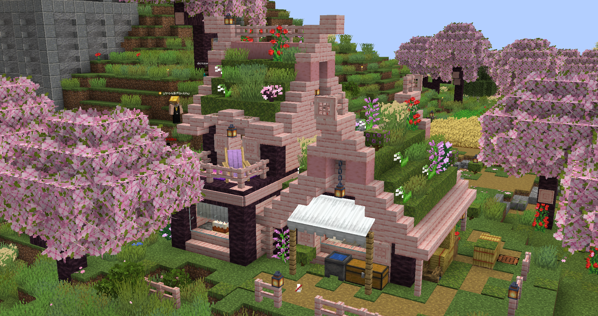
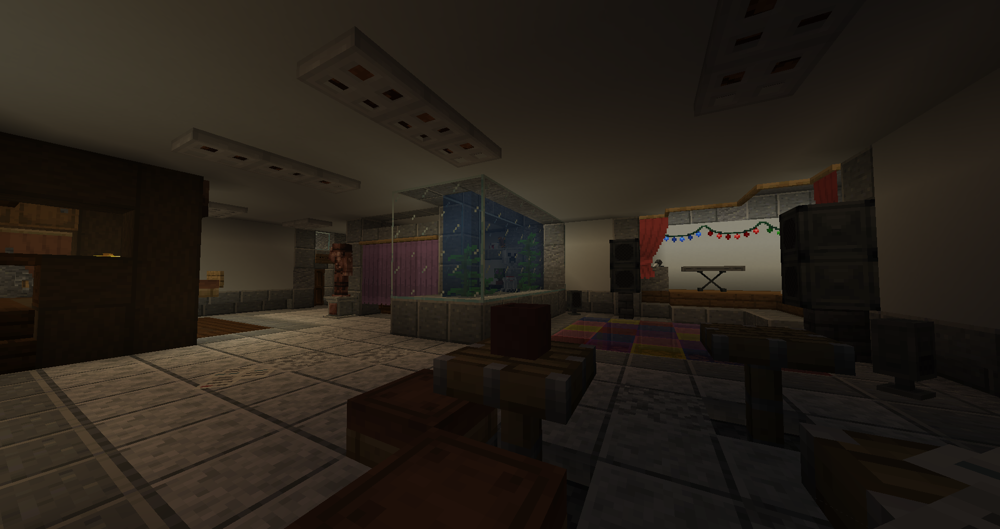
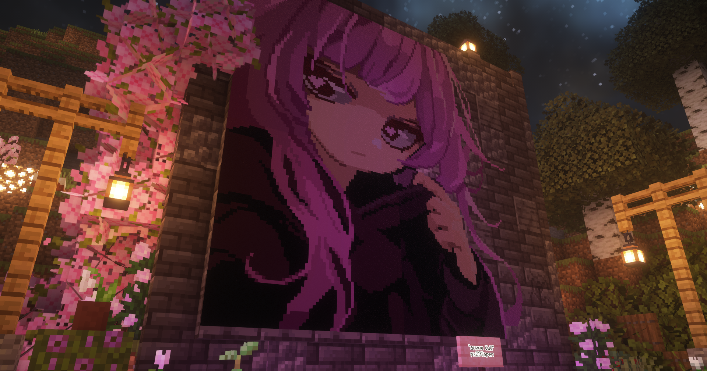

# 6 сезон

## Апрель - июнь

После 5 сезона, сервер ушёл на разработку, пока не выйдет версия 1.21. Конечно, это было много, но зато админам не пришлось бы открывать сервер на старой версии, а потом обновлять его два раза на последующие версии. За три месяца планировалось немного отдохнуть, пофиксить все критические баги, создать новые механики и прочее.

## 20 июня

За 10 дней до открытия сервера оказалось что ни стабильной версии ядра ни стабильных плагинов на 1.21 нет. Более того - половины плагинов не было и на 1.21.1...

Всекоты решили опросить игроков что лучше сделать в такой ситуации - открыться на 1.21.1 с включёнными **недоделанными** фишками 1.21 или открыться на 1.21.1 без фишек и с ограничением мира в 2500 блоков. Котики выбрали второй вариант. В конце концов была выбрана дата открытия - 12 июля. *но хитрые админы перенесли открытие на ещё один день.*

## 13 июля

Грандиозное открытие... с 1 ТПС. Оказалось что сервер авторизации не выдержал **81 одновременных игрока**, от чего он очень сильно нагружался и влиял уже на обычный сервер. Открытие перенеслось на час, за который был куплен новый сервер, поставлен новый сервер авторизации и были запущены игроки - в этот раз без лагов!

Пик онлайна в день достиг **81 человек**, но на "второе" открытие зашло **76 человек**. Абсолютный рекорд сервера (прошлый рекорд - 45 человек)!

{ width=75% decoding="async" loading="lazy" }

## 13-15 июля

Куча баг-фиксов, все игроки развивались, трое даже успели написать репорт в КСБ. Но из-за того, что все развиваются, Офицеров банально не хватает...

## 19 июля

Объявление конкурса строителей от Всекотов! Главная задача - построить что-угодно, но с использованием новой механики [Мебели и декора](../gameplay/unique/decor.md)!  
Оценка производилась админским составом по общей красоте постройки, использованию декораций и внимания к деталям.

Награды:  
1. К+++ на месяц, ещё невышедший набор обликов "Зондбе-апокалипсис", 8 шаблонов незеритового улучшения  
2. К++ на месяц, 50 АР, 4 шаблона незеритового улучшения  
3. К++ на 2 недели, 50 АР  

## 22 июля

CharaBell купила пост у Репортёров о том, что она спрятала её плюшевую игрушку где-то на территории всего Кошкокрафта, и объявила на неё охоту. Как итог - игрушка оказалась в маленьком доме внутри горы где-то на окраине мира...

В этот же день были подведены итоги Конкурса строителей! Победители:

1. px239apen  

2. dark_moooon  

3. ytrbqdkflbvbhy 

## ~26-28 июля - panda6001 incident

Игрок **panda6001** решил сделать постройку около спавна - это был остров на воде с маяком, котиком и мостом к столице. Постройка была плюс-минус санкционированной - она была одобрена серёжей зарканом, хоть разрешение на постройку вблизь столицы нужно спрашивать у соответсвующего члена Совета Пяти.

После постройки вокруг этого острова разразился скандал - многим не понравился остров настолько близко к столице и не понравилось наличие второго маяка. И хоть остров был вполне себе, было решено перенести хотя бы маяк. В последующем было известна причина постройки такого острова - все ближайшие территории к столице были уже заняты, и, поэтому, панда решил сделать себе личный остров. Но данный остров очень не понравился двум игрокам - **Eternal76** и **ascett**. 

Эти двое игроков пытались спорить с пандой о том, что остров нужно снести, ведь он не получал разрешение, на что панда отвечал что разрешение получил, и ему нужен этот остров, ведь все ближайшие территории уже заняты. Спор был в столице на протяжении часа-полтора, и привлёк к себе 10-15 человек. Самой большой проблема спора было то, что **Eternal76** был **экономистом** в Совете Пяти, а **ascett** и вовсе обычным котиком, и непонятно зачем **они** продолжали спорить, нежели отдать решение **строителю** из Совета Пяти.

Как итог - после спора, панда, видимо от злости, перепутал Eternal76 с другим игроком, и решил убить его, и ~27 июля **Eternal76** написал на панду репорт в КСБ. Панду посадили в тюрьму ещё даже до принятия репорта и всячески над ним издевались - в частности *бывший* офицер КСБ **Asp1re1337** постоянно его убивал, а **ГКСБ** Ystika игнорировал такое поведение своего подчинённого. Как итог - эта информация стала известна серёже заркану, и он принял репорт самостоятельно.

После тщательной проверки видеозаписей, всем участникам данного конфликта были выданы такие наказания:

- panda6001 - 15 дней тюремного заключение - убийство члена Совета Пяти

- Asp1re1337 - изгнание на 14 дней, лишение возможности быть в КСБ и подобных на всех последующих сезонах

- ascett - 30 дней потери речи в чате и в войсчате - зачем-то участвовал в этом конфликте и издевался над пандой

- Eternal76 и Ystika - выговор - неподобающее поведение на своих постах

- Charanixy - мут на 7 дней - всячески подливал масла в огонь

- sm1lly - последнее предупреждение за игнорирование такого поведения между котиков на посту Всекотёнка

В последующем наказания были немного облегчены.

Очевидно было известно, что панда6001 не самый умный и адекватный игрок, но наказания были выданы не в защиту этого... человека, а скорее чтобы котики поняли, что на своих постах так себя вести не стоит, и все конфликты можно решить намного более гуманными методами.

***

После этого, panda6001, обиженный жизнью, решает созвать весь свой клан на всяческие плохие деяния на сервере - были подожжены и взорваны несколько городов, была построена лаг-машина, сожгли свой же город. Таким образом весь клан "Сакура", под руководством panda6001, ушёл с сервера, оставив огромное коричневое пятно *которое было восстановлено парой команд за пару секунд.*  
По словам одного из членов клана, в нём насчитывалось ~50 человек, но после ухода клана с сервера, онлайн просел лишь на 5-10 человек. Вот так и живём.

А остров мы потом взорвали нахуй.

<video width="75%" height="75%" controls>
  <source src="../../../assets/server_history/season6/panda_kaboom.mp4" type="video/mp4">
</video>

## 25-28 июля

- Был объявлен ивент Эпической битвы - игрокам нужно было выбрать сторону сражения и поучаствовать в трёх битвах!

  - В итоге битв победили **CeIsiu**, **Kokco_Rachik0** и **vasily_00777**, каждый из которых получил по 50 АР.

- Репортёры получили повышение зарплаты - 25 АР за пост!

## 28 июля

Изменение законов!

Поменялись минимальные цены на зачарования, исправлены нелогичности и изменены законы торговли.

В этот же день зарплата репортёров была увеличена до **30 АР** за пост + премии за хорошие посты и/или видео с Кошкокрафта!

В этот же день Столица была отмечена красным ковром.

## 31 июля

Через репортёров, неизвестный котик выложил свою кассету под названием "Кассета #1 - Введение". Себя этот котик подписал как **???**.

??? note-cc "Содержимое кассеты"
    Доброго времени страна!

    Я ???, желаю открыть глаза вам, жителям страны... если оно так сейчас называется.

    Сразу к делу.
    Я действительно этого не понимаю, многие, как я считаю, понимать не хотят, но мы буквально находилось n-время в пустоте рядом с опечаленным Всекотцом, и после n-время резко появилось одновременно все и ничего, столица и мир цветущий, наполненный живностью.

      И никто, никто не задумался - "Почему, как, зачем?", создал это . Вдруг, мы в симуляции? И мир нереален? Вдруг... тот кому мы молимся каждый день, нереален??
    Я считаю, что нужно делать эксперименты и ................
    
    Конец ленты

## 2 августа

Вышло интервью от **yourophelia** с **dark_moooon**!

??? note-cc "Интервью"
    Репортер: Есть ли у вас любимый стиль строительства? Влияет ли это на ваши проекты?
    Дарк Мун: Что такое стиль? Отчётливой любви к какому-то стилю нет, да и постройки у меня не придерживаются четкой стилистики. Не влияет.

    Репортер: Как вы справляетесь с творческим застоем? Есть ли у вас особые методы или источники вдохновения?
    Дарк Мун: Их либо нет, либо я строю через силу. Строить-строить-строить!

    Репортер: У вас есть планы/новые проекты у вас на горизонте?
    Дарк Мун: Да есть планы. База большая будет. Склад буду делать крутой, всё это будет в самом крутом клане "кайфоград".

    Репортер: Какие ощущения вы испытываете, занимая должность главного строителя? С какими трудностями вы сталкиваетесь, и что приносит вам наибольшее удовольствие в вашей работе?
    Дарк Мун: Я испытываю ничего. С котиками, которые могли бы переделать что-то без конфликта, но им впадлу.

    Репортер: Есть ли места в столице, которые вы рекомендуете для строительства коммерческих объектов, таких как магазины или кафе? Почему вы считаете эти локации подходящими?
    Дарк Мун: Да, торговая зона. Она самая подходящая.

    Репортер: Какие правила и требования нужно учитывать при строительстве на свободных участках?
    Дарк Мун: Ну правил-то особо и нету, главное не выходить за выделенные границы, и то в рамках разумного можно.

    Репортер: Кому следует обращаться, чтобы получить разрешение на строительство или обсудить планируемый проект, например, магазин?
    Дарк Мун: Ко мне.

## 4 августа

Объявление **Конкурса художников**, используя [новый датапак на рисование](../gameplay/unique/artmap.md)!  
Тема любая, но, в отличие от прошлых конкурсов, оценивание рисунков стало **народным** - победителей выбирали все игроки сервера.

Призовые места:  
1. К+++ на месяц, 8 шаблонов незеритового улучшения  
2. К++ на месяц, 6 шаблонов незеритового улучшения  
3. К++ на 2 недели, 50 АР

## 6 августа

На сервере разгорелся конфликт между союзными кланами VinBurg и StoneHall. Причиной стали неоформленное здание и таблички с запретом прохода на территории StoneHall. Спор настолько обострился, что понадобился третейский судья, которым стал игрок TOMMY_WERSETY. Судебный процесс был напряжённым: стороны выдвигали взаимные обвинения, и даже были привлечены свидетели.

Одним из ключевых моментов стало заявление от sqrefo_ о том, что и у противоположной стороны есть незаконченные работы. Это замечание повлияло на окончательное решение.

В итоге был составлен договор: VinBurg обязался оформить здание в средневековом стиле и убрать запретные таблички, а StoneHall — декорировать берег. Нарушение условий грозит штрафом в 250 АР. Теперь кланы стараются выполнить условия, но вопрос остаётся: надолго ли стихли страсти?

## 7 августа

Был создан гос. заказ - уничтожить [город клана Сакура](#26-28-июля---panda6001-incident). Оплата - всё, что игроки найдут/вскопают на территории города. К сожалению Всекотец не учёл, что не все из клана Сакуры ушли и были против Кошкокрафта...

{ width=75% decoding="async" loading="lazy" }

В этот же день было первое упоминание супергероя сервера - КЗАНЕКС-МЕНА! Этот отважный котик влетел в горящее здание (которое сам и поджёг) и спас внебрачную дочку bykkake747. Жители Кайфограда с облегчением вздохнули, радуясь, что их герой все-таки справился с этой задачей. Однако никто не забыл, что даже супергерои могут быть немного пироманами!

Жители кайфограда лизните мои яцйа (сори)

В этот же день **Ystika** покидает пост ГКСБ, и на его место приходит **JOY6OY**! В последующем данный котик очень бустанёт РП у КСБ, проводя крутые уроки и тренировки.

## 8 августа

Изменение законов!

- Удален закон о том, что новые законы действительны только для новых репортов/инцидентов.

- Добавлен закон о правильной разметке территории

- Добавлено обозначение границ Столицы и Незер-хаба

В этот же день ГКСБ **JOY6OY** провел первую тренировку Кадетов КСБ - **Elivor_**, **Sy05** aka **папазогло** и **sardinarede**. На тренировке ГКСБ объснял кадетам как правильно себя вести, поддерживать РП и использовать экипировку.

## 9 августа

КЗАНЕКС-МЕН ушёл. Связано это с тем, что Всекотец снял с поста модератора **sm1lly**, не объяснив за что, от чего у **sm1lly** и его друзей возникло недовольство по поводу такого безрассудного поступка. В последствии Всекотец объяснил конкретные причины увольнения, и всё было хорошо, и все живы, и слава тебе господи.

Извините... у меня тогда был плохой день...

В этот же день Неизвестный котик выпускает свою вторую кассету - "Кассета #2 - Следственный эксперимент"

Кратко - неизвестный котик, начавший эксперимент под названием #ИНЦИДЕНТ, собирает мнения десяти игроков-котят о произошедших событиях. Некоторые персонажи высказываются об изменении реальности и опасности порталов, в то время как другие либо не помнят произошедшее, либо воспринимают всё с недоверием или безразличием.

??? note-cc "Не кратко"
    С вами опять я, ???, после недельной пропажи, и сегодня я начну действовать, точнее, я уже действую! Я начал эксперимент под названием #ИНЦИДЕНТ. Я спросил у 10 игроков, что они думают по поводу всего случившегося, и вот наши ответы:

    Котёнок 1 - Сказал, что тот, кто ищет, тот всегда найдёт! 

    Котёнок 2 - Замечательно! Значит, это услышит большое количество людей! Слушайте и просто поверьте! Это будет лучшее решение для всех вас — просто поверить, даже если вам будет непонятно! Я являюсь учёным в сфере квантово-физических порталов. По непонятной мне причине я оказался не в своей реальности, меня здесь быть не должно, но это и не важно. Сейчас мы с напарником изучаем и проектируем оборудование для чтения порталов, так как по непонятной мне причине Узлы Связи 17 миров никак не задействованы с этой реальностью! И ещё! Пожалуйста, будьте аккуратнее — ни в коем случае не смотрите и не прикасайтесь к порталам, похожим по структуре на G354OL, они очень нестабильны и могут вызвать измене........ Кассета заглючила......

    Котёнок 3 - Назвал меня шизиком и послал далеко (ожидаемо).

    Котёнок 4 - Я не понимаю, о чем ты... Я не помню такого...

    Котёнок 5 - Я не помню этого.....

    Котёнок 6 - Почему же никто не задаётся этим вопросом? Этот вопрос и правда мало кого волнует, из-за того, что все живут настоящим, думают, как жить, как заработать и как выжить в этом суровом мире, в котором мы по факту появились из ниоткуда.

    Котёнок 7 - Ты хто, бля? Объяснись сначала! Это первое. Второе — да плевал я с высокой колокольни, жи есть.

    Котёнок 9 - Моя позиция? Мне кажется, что пока котята счастливы, всё замечательно, и не стоит совать свои котячьи носики куда не нужно!^^ 

    И-иитак... Что мы имеем? Нашим великим котятам стерли память..... изучайте данную информацию... а я меняю свое местоположение, на меня кто-то точит клык... иии займусь номером два.... 

    Конец ленты

## 11 августа - Заприваченный незер-хаб

Репортёр yourophelia выпустила пост о недавнем инциденте о приватизации Незер-хаба обычными гражданами. Краткая суть поста:

На Кошкокрафте всплыли законодательные дыры, которые стали причиной конфликтов и манипуляций. Основным эпицентром разногласий стал Незер-хаб, который приватизировал Эндермен, используя пробелы в законах. Его действия вызвали критику со стороны других жителей, таких как Даркмун и Аскетт. Совет Пяти, осознав проблему, начал вносить изменения в законодательство, чтобы закрыть уязвимости и предотвратить подобные ситуации в будущем.

Котята Аскетт, Авокато и Энтернал активно участвовали в урегулировании конфликта, уточняя правила приватизации и работая над ясностью законов. Эндермен, который изначально создавал конфликт, утверждает, что его действия лишь ускорили нужные изменения. Однако другие участники считают, что он просто воспользовался ситуацией для собственной выгоды.

В результате конфликт был разрешён благодаря совместным усилиям жителей, но остаётся опасение, что подобные дыры в законодательстве могут использоваться для провокаций в будущем.

Также в этот день завершился [конкурс художников](#4-августа). Победителями стали:

1. **px293apen** и **kizex** - оба набрали одинаковое количество баллов

    { width=75% decoding="async" loading="lazy" }

    { width=75% decoding="async" loading="lazy" }

2. **sm1lly**

    { width=75% decoding="async" loading="lazy" }

3. **GroM7IcE7**

    { width=75% decoding="async" loading="lazy" }

To be continued.....................
