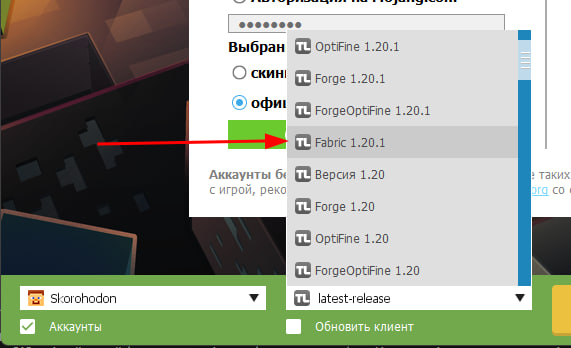

# Как устанавливать моды?

Здесь мы кратко расскажем как скачивать моды на разные лаунчеры.

!!! tip ""
    Мод это файлик с припиской `.jar` на конце. Не путайте с `.rar` или `.zip`!

## **TLauncher**

!!! warning "Совет"
    Не советуем играть на этом лаунчере - он ломает скины и очень плохо оптимизирован. Список хороших лаунчеров в [этой статье](launcher.md).

1. Нажимаешь на иконку **папки**

2. В открывшейся папке создаёшь новую с названием `mods`

3. Закидываешь туда все нужные моды

4. Заходишь в лаунчер, выбираешь `Fabric + версию нашего сервера` 

5. Запускаешь и играешь!

## **Официальный Майнкрафт Лаунчер**

!!! warning "Совет"
    Не советуем играть на этом лаунчере - он банально не удобен. Список хороших лицензионных лаунчеров в [этой статье](launcher.md).

1. Переходишь на [https://fabricmc.net/](https://fabricmc.net/) и кликаешь огромную синую кнопку `download here

2. Запускаешь скачанный файлик. В нём выбираешь свою версию и правильный путь установки (туда, где находится майнкрафт, обычно он находится в `C:\Users\ТвоёИмя(антон)\AppData\Roaming\minecraft`) 

3. Перезагружаешь лаунчер, в версиях замечаешь новый пункт с названием примерно `fabric-mc-1.3.37-1.20.1` 

4. Заходишь в папку игры (тот же путь, что и в пункте 2), создаёшь в ней папку с названием `mods` (или просто запускаешь Майнкрафт и закрываешь)

5. Перекидываешь нужные моды в эту папку `mods`

6. Запускаешь игру и радуешься жизни!

## **Legacy Launcher**

1. Нажимаешь на кнопку папки в лаунчере

2. В открывшиеся папке создаёшь папку `mods`, если таковой нет

3. Скачиваешь моды и перекидываешь их туда 

4. Выбираешь в версиях `Fabric <текущая версия сервера>`

5. Запускаешь и играешь!

