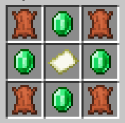
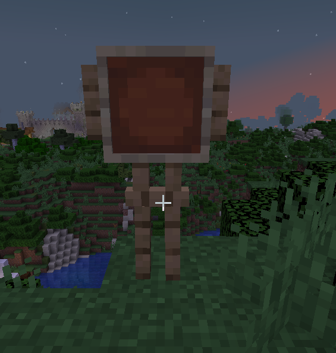
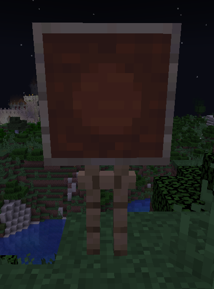
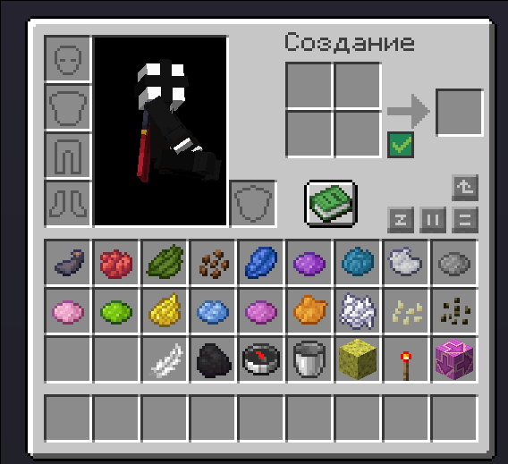
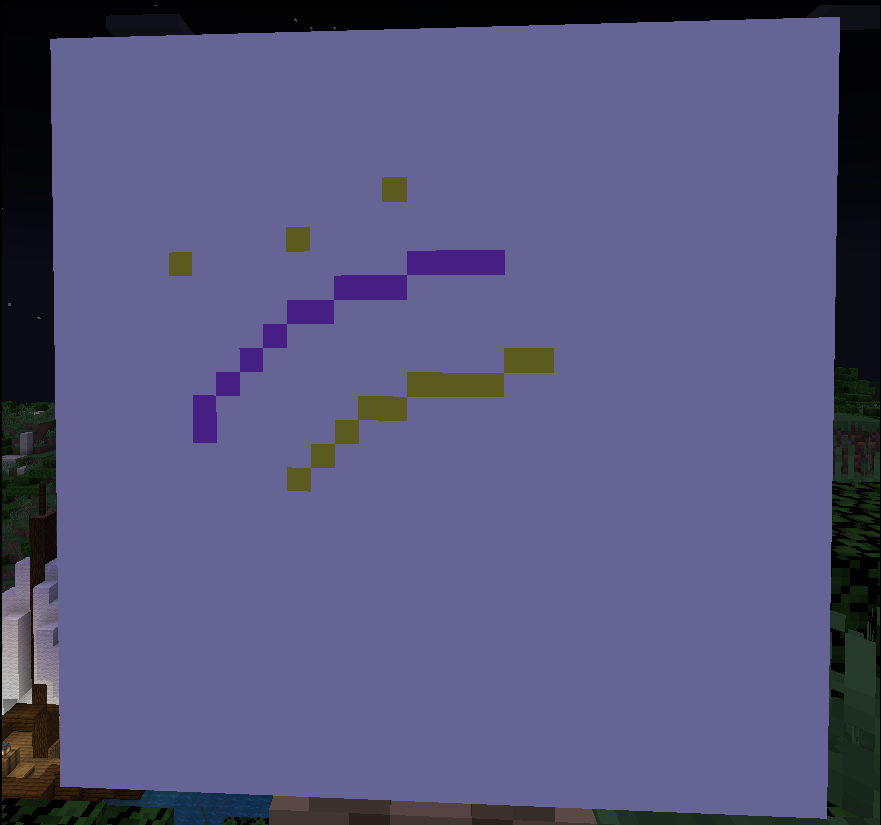

# Рисование на картах

На сервере стоит замечательный плагин на рисование прям на карте! Больше никаких громоздких мап-артов - создавайте свои шедевры, сидя за холстом!

## **Как начать рисовать?**

Тебе нужны две вещи - холст и мольберт! Их крафты ты можешь посмотреть командой `/art`

Всем игрокам доступен бесплатный набор `/kit art`! В нём один мольберт и 16 холстов.

## Крафты

#### Мольберт

#### Холст

Далее ставишь мольберт на любой твёрдый блок

{width=350}

И по нему кликаешь `ПКМ` с холстом в руке

{width=350}

Далее кликаешь по всей этой конструкции `ПКМ` и садишься рисовать!

Ты можешь заметить, что весь твой инвентарь заменён на красители - не переживай. Все предметы вернуться, как только ты выйдешь из-за холста. 

Красителей в твоём инвентаре более 100 штук и чтобы показать следующую страницу красителей, просто нажми `ЛКМ` по **розовой терракоте** в инвентаре.

{width=350}

Чтобы рисовать, берешь нужный предмет, и зажимаешь `ПКМ`! Также ты можешь рисовать по пикселям, нажимая `ЛКМ`.

{width=350}

Также у плагина есть инструменты, например **Заливка** или **Поворот**. Их ты также найдёшь в инвентаре!

## **Как сохранить рисунок?**

Прописываешь `/art save <название>`, и всё! Рисунок сохранён тебе в руки, а также в твой профиль. 

Рисунки других игроков ты можешь также найти командой `/art`

