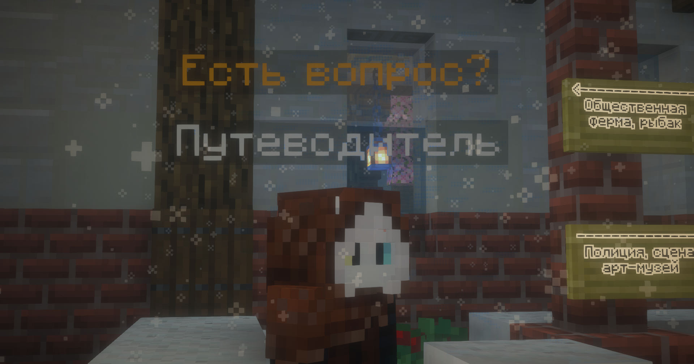

# NPC

В нашей столице ты сможешь найти разнообразных людей (и даже не очень людей), с различными историями и заданиями!

!!! tip "Как взаимодействовать с NPC?"

    - <kbd>ПКМ</kbd> на NPC - активировать диалог

    - Клавиши ++w++ и ++s++ или колёсико мыши - прокручивание вариантов диалога

    - <kbd>ПКМ</kbd> или ++space++ - выбор варианта диалога

    - ++left-shift++ - прекратить диалог

# Список NPC

??? tip "Путеводитель - гид по серверу"

    Находится прямо в столице, отвечает на частые вопросы новичков и позволяет телепортироваться в любые 4 стороны на 3500 блоков!

    { width=500 }

??? tip "Бармен - ежедневные квесты"

    Мишаня самый добрый в нашем городе! Продаёт алкоголь и выдаёт ежедневки! Они обновляются в 00:00 по МСК.

    

??? tip "Банкир - операции с АРами"
    Позволяет пополнить или снять АРы со своего счёта!

    Находится в своём здании Банка.

??? tip "Служительница храма"
    **Вера** - служительница храма при Всекотце, даёт благословления - хорошие эффекты раз в сутки. Если пожертвовать ей АРы, то благословление будет иметь более хороший эффект.
    
??? tip "Валера - посмотреть наборы обликов"
    У Валеры работа простая - через него можно увидеть вживую все Наборы Обликов! О них - [по этой ссылке](../../Информация/donate.md)

??? tip "Рыбак - продать рыбу"
    Некогда владыка морей теперь пришвартовался в городе. Ему можно продать почти всю рыбку, словленную в море! 

    [О рыбках по этой ссылке](../../Геймплей/УникальныеФишки/рыбалка/fishing_gamelist.md)

??? tip "Музыкант - купить кастомную музыку"
    Всё время слушает музыку, но позволяет тебе создать кастомную пластинку со своей песней из **Внешнего мира**!

    Подробнее - [в этой статье про войсчат](../УникальныеФишки/voicechat.md)

??? tip "Генерал Владимир - информация по Незер-хабу"
    Находится в Аду, на этаже с магазинами, и даёт по ним информацию!

    Где-то я его уже видел... В каком-то... [сериале](https://youtu.be/vYCLiCmdWGk?t=995)...

    
    

