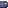
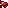
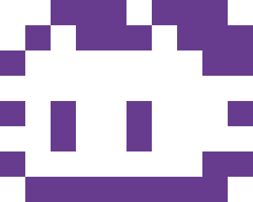
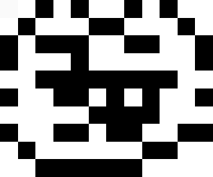

# Префиксы и суффиксы в игре

!!! note ""
    **Префикс** - иконка **перед** ником. **Суффикс** - после ника.

## Префиксы

| Иконка | Что обозначает? |
| :------- | :--------------- | 
|{ width=20 }|Префикс Всекотов - администрации.|
|{ width=20 } { width=20 } { width=20 }|Префикс Котика+ - привилегии. Подробнее [на этой странице](../../Информация/donate.md).|
|{ width=20 }|Префикс **кадета** КСБ.|
|{ width=20 }|Префикс **Офицера** КСБ.|
|{ width=20 }|Префикс **Главы** КСБ.|
|{ width=20 }|Префикс заключённого. Даётся автоматически, если игрок в тюрьме.|
|{ width=20 }|Префикс Репортёров.|
|{ width=20 }|Префикс Ютубера. Можно получить, став [нашим партнёром](../../Информация/for_media.md).|
|{ width=20 }|Префикс стримера. Можно получить, став [нашим партнёром](../../Информация/for_media.md).|
|{ width=35 }|Префикс АФК. Даётся автоматически, если игрок неактивен.|
|{ width=20 }|Секретный префикс.|

## Суффиксы
| Иконка | Что обозначает? |
| :------- | :--------------- | 
|{ width=20 }|Суффикс **новичка** - даётся автоматически, пока игрок не наиграет 15 часов.|
|{ width=20 }|Суффикс розыска - даётся автоматически при объявлении игрока в розыск.|