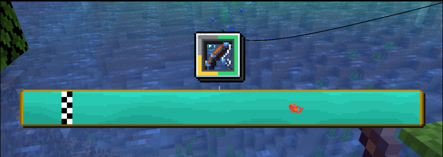

# Список игр

На сервере стоит уникальный плагин на рыбалку! Теперь вам не нужно тупо стоять в АФК полчаса, нажимая `ПКМ`, вместо этого ловля рыбы превращается в мини-игру!

Почти всех рыбок можно продать **NPC Рыбак**, он стоит на спавне! Цена рыб зависит от редкости, и варьируется от **0.1** до **5** АР! 

!!! warning "Важно"
    Рыбалка не работает без ресурспака сервера!

***

## Все мини-игры

### **Гонка**

Нажимая на ++left-shift++, нужно довести рыбку до конца, но нужно следить за индикатором, иначе леска оборвётся!

### **Попади в цвет**

Тут всё просто - нужно вовремя нажать `ПКМ` по определённому цвету.

### **Удержи**

Тут, нажимая ++left-shift++, нужно удержать рыбку на зелёной области

### **Попади**

Тут нужно попасть в зелёную область! 

Зелёный - 100% 
Жёлтый - 50% 
Оранжевый - 25% 
Красный - 0%

### **Попади в цвет**

Тут тоже всё просто - нужно попасть в цвет, написанный на экране!

### **Накликай**

Всё просто - нужно кликнуть `ПКМ` нужное количество раз за 15 секунд.

