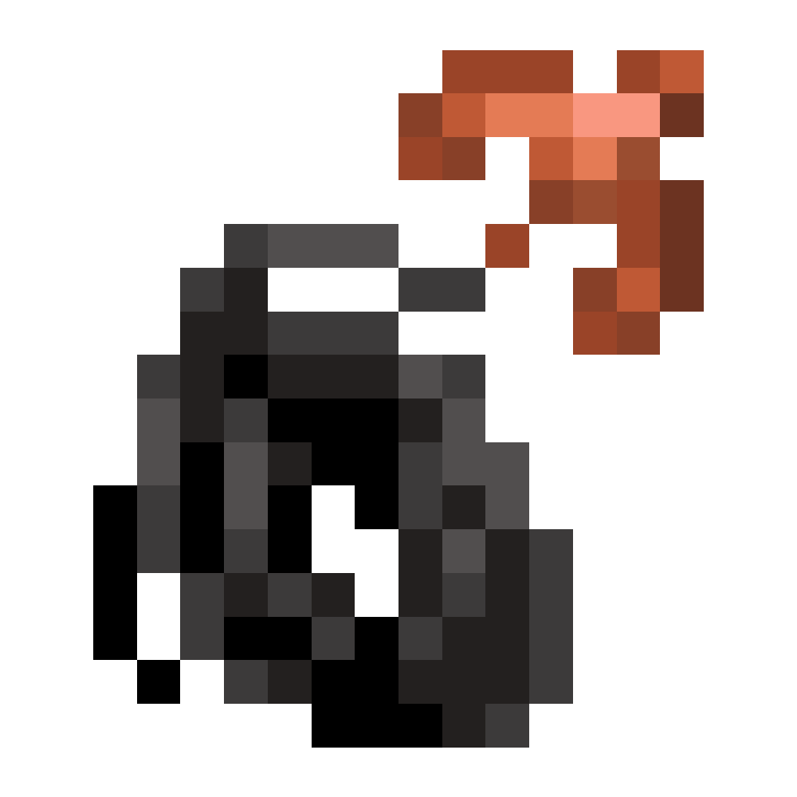

# Крюк-кошка

!!! tip inline end "Предмет"
    <figure markdown="span">
        { width=150 }
    </figure>
    ***
    **Название:** Крюк-кошка
    ***
    **Тип:** Предмет
    ***
    **Получение:**
    
    - Крафт
    ***
    **Текстура by:** bykkake747
    ***
    **Идея by:** Всекотец

**Крюк-кошка** - предмет, позволяющий цеплятся за блоки или мобов (или даже игроков!) и "прыгать" к ним!

## Крафт

Крафт крюка-кошки состоит из **Крюка** и ниток.

### Крафт крюка

{ width=400 }

### Крафт крюка-кошки

{ width=400 }

***