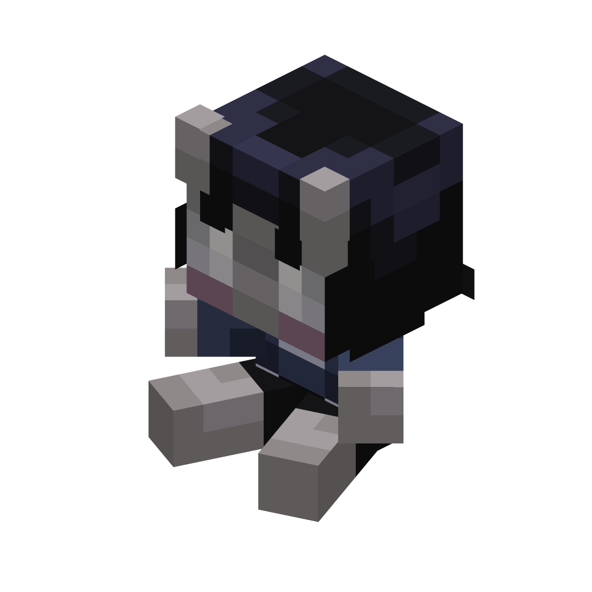

# Плюшевые игрушки

!!! tip inline end "Предмет"
    <figure markdown="span">
        { width=150 }
        { width=150 }
        { width=150 }
    </figure>
    ***
    **Название:** Плюшевая игрушка
    ***
    **Тип:** Предмет
    ***
    **Получение:**
    
    - Неизвестно

    ***
    **Текстура by:** bykkake747
    ***
    **Идея by:** bykkake747

**Плюшевая игрушка** - мягкие игрушки. Эти персонажи кажутся вам знакомыми...

Всего игрушек пять штук. Получить их можно, но неизвестно как.

